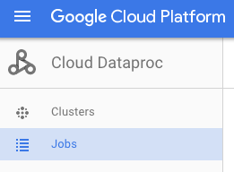
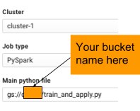

# Big Data and Machine Learning Fundamentals : Lab 1

## Part 1: Create a Compute Engine Instance

## Overview

In this lab, you spin up a virtual machine, configure its security, and access it remotely.

### What you learn

In this lab, you:

* Create a Compute Engine instance with the necessary Access and Security
* SSH into the instance

## Introduction

In this lab, you spin up a virtual machine, configure its API access, and log into it remotely.  You will rarely work with Compute Engine instances at such a low-level, but knowing the foundations of GCP can be helpful in troubleshooting.

![[/fragments/startqwiklab]]

## Task 1: Create Compute Engine instance with the necessary API access

To create a Compute Engine instance:

1. In the GCP Console, on the __Navigation menu__ (), click __Compute Engine__.

2. Click __Create__ and wait for a form to load. You will need to change some options on the form that comes up.

3. For __Name__, leave the default value, for __Region__, select __us-central1__, and for __Zone__, select __us-central1-a__.

4. For __Identify and API access__, in __Access scopes__, select __Allow full access to all Cloud APIs__:

    

5. Click __Create__.

## Task 2: SSH into the instance

When the instance is created, you can remotely access your Compute Engine instance using Secure Shell (SSH):

1. When the instance you just created is available, click __SSH__:

    

    __Note__: SSH keys are automatically transferred - allowing you to ssh directly from the browser - with no extra software needed.

2. To view information about the Compute Engine instance you just launched, type the following into your SSH terminal:

    ```
    cat /proc/cpuinfo
    ```

## Task 3: Install software

1. In the SSH terminal, type the following:

    ```
    sudo apt-get update
    sudo apt-get -y -qq install git
    ```

2. Verify that git is now installed:

    ```
    git --version
    ```

3. Exit from the session by typing:

    ```
    exit
    ```

<aside>Stop here if you are done. Wait for instructions from the Instructor before going into the next section</aside>

## Part 2: Interact with Google Cloud Storage

### What you learn

In this lab, you will:

* Ingest data into a Compute Engine instance
* Transform data on the Compute Engine instance
* Store the transformed data on Cloud Storage
* Publish Cloud Storage data to the web

## Introduction

In this lab, you spin up a virtual machine, configure its API access, and log into it remotely.  You will rarely work with Compute Engine instances at such a low-level, but knowing the foundations of GCP can be helpful in troubleshooting.

You will then carry out the steps of an ingest-transform-and-publish data pipeline manually:

* Ingest data into a Compute Engine instance
* Transform data on the Compute Engine instance
* Store the transformed data on Cloud Storage
* Publish Cloud Storage data to the web

You will use real-time earthquake data published by the United States Geological Survey (USGS).

## Task 1: SSH into the instance

Remotely access your Compute Engine instance using Secure Shell (SSH):

1. When the instance you just created is available, click __SSH__:

    

    __Note__: SSH keys are automatically transferred - allowing you to ssh directly from the browser - with no extra software needed.

2. To view information about the Compute Engine instance you just launched, type the following into your SSH terminal:

    ```
    cat /proc/cpuinfo
    ```

## Task 2: Ingest USGS data

1. On the command-line, type:

    ```
    git clone https://github.com/GoogleCloudPlatform/training-data-analyst
    ```

    This downloads the code from github.

    __Note__: If you get a git authorization error, it is likely that the github URL has a typo in it.  Please copy and paste the above code.

2. Navigate to the folder corresponding to this lab:

    ```
    cd training-data-analyst/CPB100/lab2b
    ```

3. Examine the ingest code using __less__:

    ```
    less ingest.sh
    ```

    The __less__ command allows you to view the file (Press the __spacebar__ to scroll down; the letter __b__ to go back a page; the letter __q__ to quit).

    The program __ingest.sh__ downloads a dataset of earthquakes in the past 7 days from the US Geological Survey.  Where is this file downloaded? To disk or to Cloud Storage?

4. Run the ingest code:

    ```
    bash ingest.sh
    ```

5. Verify that some data has been downloaded:

    ```
    head earthquakes.csv
    ```

    The __head__ command shows you the first few lines of the file.

## Task 3: Transform the data

You will use a Python program to transform the raw data into a map of earthquake activity:

The transformation code is explained in detail in this notebook:
[https://github.com/GoogleCloudPlatform/datalab-samples/blob/master/basemap/earthquakes.ipynb](https://github.com/GoogleCloudPlatform/datalab-samples/blob/master/basemap/earthquakes.ipynb)

Feel free to read the narrative to understand what the transformation code does.  The notebook itself was written in Datalab, a GCP product that you will learn to use in this course.

1. First, install the necessary Python packages on the Compute Engine instance. In your SSH terminal, type the following:

    ```
    bash install_missing.sh
    ```

2. Run the transformation code:

    ```
    python3 transform.py
    ```

3. You will notice a new image file if you list the contents of the directory:

    ```
    ls -l
    ```

## Task 4: Create bucket

Create a bucket using the GCP console:

1. In the GCP Console, on the __Navigation menu__ (), click __Storage__.

2. Click __Create Bucket__.

3. For __Name__, enter your __Project ID__, then click __Create__. To find your __Project ID__, click the project in the top menu of the GCP Console and copy the value under __ID__ for your selected project.

    Note the name of your bucket. For the rest of this lab, replace `<YOUR-BUCKET>` with your bucket name.

4. Click __Create__.

## Task 5: Store data

To store the original and transformed data in Cloud Storage

1. In your SSH terminal, type the following, replacing `<YOUR-BUCKET>` with the name of the bucket you created in the previous task:

    ```
    gsutil cp earthquakes.* gs://<YOUR-BUCKET>/earthquakes/
    ```

2. In the GCP Console, click the bucket name and notice there are three new files present in the __earthquakes__ folder (click __Refresh__ if necessary).

## Task 6: Publish Cloud Storage files to web

 Publish Cloud Storage files to the web with follwing command:

 ```
 gsutil acl ch -u AllUsers:R gs://<YOUR-BUCKET>/earthquakes/*
 ```
 From the GCP console, navigate to your storage bucket (click __refresh__ if necessary).

 For __earthquakes.htm__, click __Public link__.

  

  What is the URL of the published Cloud Storage file? How does it relate to your bucket name and content?

  What are some advantages of publishing to Cloud Storage?

<aside>Stop here if you are done. Wait for instructions from the Instructor before going into the next section</aside>

<ql-multiple-select-probe stem="This is my question that I am asking:"
                          optionTitles='[
                            "Wrong Answer",
                            "Correct Answer"
                          ]'
                          answerIndices='[1]'
                          shuffle>
</ql-multiple-select-probe>

## Part 3: Setup Rentals Data in Cloud SQL

## Overview

In this lab, you populate rentals data in Cloud SQL for the rentals recommendation engine to use.

### __What you learn__

In this lab, you will:

* Create Cloud SQL instance
* Create database tables by importing .sql files from Cloud Storage
* Populate the tables by importing .csv files from Cloud Storage
* Allow access to Cloud SQL
* Explore the rentals data using SQL statements from CloudShell

## Introduction

In this lab, you populate rentals data in Cloud SQL for the rentals recommendation engine to use. The recommendations engine itself will run on Dataproc using Spark ML, and you will set that up in the next lab.


## Task 1: Access lab code

To explore the lab code in Cloud Shell:

1. In Cloud Shell, type:

    ```
    git clone https://github.com/GoogleCloudPlatform/training-data-analyst
    ```

1. Navigate to the folder corresponding to this lab:

    ```
    cd training-data-analyst/CPB100/lab3a
    ```

2. Examine the table creation file using __less__:

    ```
    less cloudsql/table_creation.sql
    ```

    The __less__ command allows you to view the file (Press the __spacebar__ to scroll down; the letter __b__ to back up a page; the letter __q__ to quit).

3. Fill out this information (the first line has been filled out for you):

    | Table Name | Columns |
    |---|---|
    | Accommodation | Id, title, location, price, rooms, rating, type |
    | ________________? | ________________? |
    | ________________? | ________________? |

    How do these relate to the rentals recommendation scenario? Fill the following blanks:

    * When a user rates a house (giving it four stars for example), an entry is added to the ________________ table.
    * General information about houses, such as the number of rooms they have and their average rating is stored in the ________________ table.
    * The job of the recommendation engine is to fill out the ________________ table for each user and house: this is the predicted rating of that house by that user.

4. Examine the data files using __head__:

    ```
    head cloudsql/*.csv
    ```

    The __head__ command shows you the first few lines of each file.

## Task 2: Stage .sql and .csv files into Cloud Storage

Stage the table definition and data files into Cloud Storage, so that you can later import them into Cloud SQL:

1. From Cloud Shell within the __lab3a__ directory, type:

    ```
    gsutil cp cloudsql/* gs://<BUCKET-NAME>/sql/
    ```

    substituting the name of the bucket.

2. From the GCP console, navigate to __Storage__, then your bucket and verify that the .sql and .csv files now exist.

## Task 3: Create Cloud SQL instance

1. In the GCP console, click __SQL__ (in the Storage section).

2. Click  __Create instance__.

3. Choose __MySQL__. Click __Next__ if required.

4. For __Instance ID__, type __rentals__.

    

5. Scroll down and specify a root password.  Before you forget, note down the root password.

6. Click __Create__ to create the instance. It will take a minute or so for your Cloud SQL instance to be provisioned.


## Task 4: Create tables

1. In __Cloud SQL__, click __rentals__ to view instance information.

2. Click  __Import__ (on the top menu bar).

3. Click __Browse__. This will bring up a list of buckets. Click on the bucket you created, then navigate into __sql__ and click __table_creation.sql__.

4. Click __Select__, then click __Import__.

## Task 5: Populate tables

1. To import CSV files from Cloud Storage, from the GCP console page with the Cloud SQL instance details, click __Import__ (top menu).

2. Click __Browse__, browse in the bucket you created to __sql__, then click __accommodation.csv__. Click __Select__.

3. For __Database__, select __recommendation_spark__.

4. For __Table__, type __Accommodation__.

    

5. Click  __Import__.

6. Repeat the __Import__ (steps 1 - 5) for __rating.csv__, but for __Table__, type __Rating__.

## Task 6: Explore Cloud SQL

1. To explore Cloud SQL, you can use the mysql CLI. In Cloud Shell, type the following:

    ```
    wget https://dl.google.com/cloudsql/cloud_sql_proxy.linux.amd64 -O cloud_sql_proxy
    chmod +x cloud_sql_proxy
    ```
2. In the GCP Console, find the SQL __Instance connection name__ in the Overview tab and copy it. In the command below, replace <INSTANCE_CONNECTION_NAME> with this value and run it.

  ```
 ./cloud_sql_proxy -instances=<INSTANCE_CONNECTION_NAME>=tcp:3306 &
 ```

3. Connect to the Cloud SQL instance using mysql:

  ```
  mysql -u root -p --host 127.0.0.1
  ```

4. MySQL will prompt you for the root password. Enter the password when prompted.

5. In Cloud Shell, at the mysql prompt, type:

    ```
    use recommendation_spark;
    ```

    This sets the database in the mysql session.

6. View the list of tables you created. This will be helpful to prevent any typos in your query in step 4.

    ```
    show tables;
    ```

7. Let's verify that the data was loaded.

    ```
    select * from Rating;
    ```

    Example output:

    ```
    | 23     | 99     |      5 |
    | 4      | 99     |      4 |
    | 7      | 99     |      5 |
    | 8      | 99     |      5 |
    +--------+--------+--------+
    1186 rows in set (0.03 sec)
    ```

8. Let's see if there is a great deal out there somewhere.

    ```
    select * from Accommodation where type = 'castle' and price < 1500;
    ```

    All the cheap castles are rated poorly.

9. You may exit the mysql prompt by typing __exit__.

<aside>Stop here if you are done. Wait for instructions from the Instructor before going into the next section</aside>

## Part 4: Recommendations ML with Dataproc

## Overview

In this lab, you carry out recommendations machine learning using Dataproc.

### What you learn

In this lab, you will:

* Launch Dataproc
* Run SparkML jobs using Dataproc

## Introduction

In this lab, you use Dataproc to train the recommendations machine learning model based on users' previous ratings. You then apply that model to create a list of recommendations for every user in the database.

In this lab, you will:

* Launch Dataproc
* Train and apply ML model written in PySpark to create product recommendations
* Explore inserted rows in Cloud SQL

## Task 1: Launch Dataproc

To launch Dataproc and configure it so that each of the machines in the cluster can access Cloud SQL:

1. In the GCP Console, on the __Navigation menu__ (), click __SQL__ and note the region of your Cloud SQL instance:

    

    In the snapshot above, the region is `us-central1`.

2. In the GCP Console, on the __Navigation menu__ (), click __Dataproc__ and click __Enable API__ if prompted. Once enabled, click __Create cluster__.

3. Change the zone to be in the same region as your Cloud SQL instance. This will minimize network latency between the cluster and the database.

4. For __Master node__, for __Machine type__, select __2 vCPUs (n1-standard-2)__.

5. For __Worker nodes__, for __Machine type__, select __2 vCPUs (n1-standard-2)__.

6. Leave all other values with their default and click __Create__.  It will take 1-2 minutes to provision your cluster.

7. Note the __Name__, __Zone__ and __Total worker nodes__ in your cluster.

8. In Cloud Shell, navigate to the folder corresponding to this lab and authorize all the Dataproc nodes to be able to access your Cloud SQL instance, replacing `<Cluster-Name>`, `<Zone>`, and `<Total-Worker-Nodes>` with the values you noted in the previous step:

    ```
    cd ~/training-data-analyst/CPB100/lab3b
    bash authorize_dataproc.sh <Cluster-Name> <Zone> <Total-Worker-Nodes>
    ```

    When prompted, type __Y__, then __enter__ to continue.

## Task 2: Run ML model

To create a trained model and apply it to all the users in the system:

1. Edit the model training file using `nano`:

    ```
    nano sparkml/train_and_apply.py
    ```

2. Change the fields marked #CHANGE at the top of the file (scroll down using the down arrow key) to match your Cloud SQL setup (see earlier parts of this lab where you noted these down), and save the file using __Ctrl+O__ then press __Enter__, and then press __Ctrl+X__ to exit from the file.

3. Copy this file to your Cloud Storage bucket using:

    ```
    gsutil cp sparkml/tr*.py gs://<bucket-name>/
    ```

4. In the __Dataproc__ console, click __Jobs__.

    

5. Click __Submit job__.

6. For __Job type__, select __PySpark__ and for __Main python file__, specify the location of the Python file you uploaded to your bucket.

    

    `gs://<bucket-name>/train_and_apply.py`

7. Click __Submit__ and wait for the job Status to change from `Running` (this will take up to 5 minutes) to `Succeeded`.

    

    If the job `Failed`, please troubleshoot using the logs and fix the errors. You may need to re-upload the changed Python file to Cloud Storage and clone the failed job to resubmit.

## Task 3: Explore inserted rows

1. In the GCP Console, on the __Navigation menu__ (), click __SQL__ (in the Storage section).

2. Click __rentals__ to view details related to your Cloud SQL instance.

3. Under __Connect to this instance__ section, click __Connect using Cloud Shell__. This will start new Cloudshell tab. In Cloudshell tab press __enter__.

    It will take few minutes to whitelist your IP for incoming connection.

4. When prompted, type the root password you configured, then __enter__.

5. At the mysql prompt, type:

    ```
    use recommendation_spark;
    ```

    This sets the database in the mysql session.

6. Find the recommendations for some user:

    ```
    select r.userid, r.accoid, r.prediction, a.title, a.location, a.price, a.rooms, a.rating, a.type from Recommendation as r, Accommodation as a where r.accoid = a.id and r.userid = 10;
    ```

    These are the five accommodations that we would recommend to her. Note that the quality of the recommendations are not great because our dataset was so small (note that the predicted ratings are not very high). Still, this lab illustrates the process you'd go through to create product recommendations.

![[/fragments/endqwiklab]]

Last Manual Updated Date: 2019-03-06

Last Tested Date: 2019-03-06

![[/fragments/copyright]]
