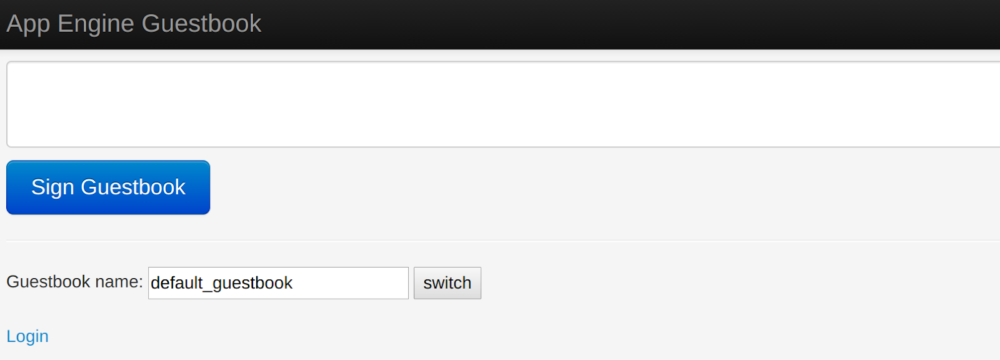
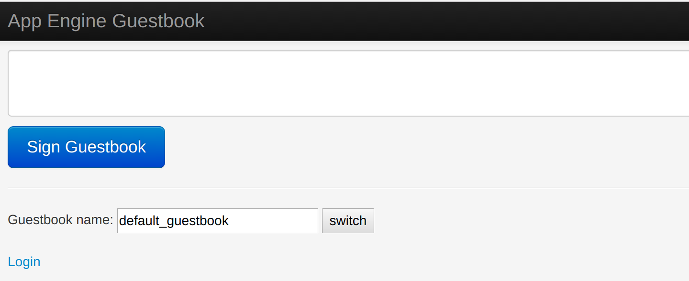
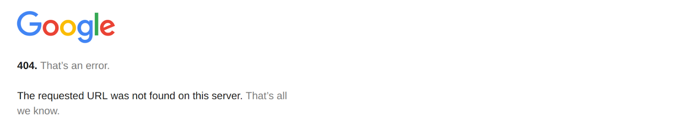
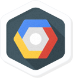

# Getting Started with App Engine

## Overview

In this lab, you create a simple App Engine application using the Cloud Shell local development environment, and then deploy it to App Engine.

## Objectives

In this lab, you learn how to perform the following tasks:

* Preview an App Engine application using Cloud Shell.
* Launch an App Engine application.
* Disable an App Engine application.

## Task 1: Sign in to the Google Cloud Platform (GCP) Console

![[/fragments/startqwiklab]]

## Task 2: Preview an App Engine application

1. On the __Google Cloud Platform__ menu, click __Activate Cloud Shell__ . If a dialog box appears, click __Start Cloud Shell__.

2. Clone the source code repository for a sample application called __guestbook__:

    ```
    git clone https://github.com/GoogleCloudPlatform/appengine-guestbook-python
    ```

3. Navigate to the source directory:

    ```
    cd appengine-guestbook-python
    ```

4. List the contents of the directory:

    ```
    ls -l
    ```

5. View the __app.yaml__ file and note its structure:

    ```
    cat app.yaml
    ```

    YAML is a templating language. YAML files are used for configuration of many Google Cloud Platform services, although the valid objects and specific properties vary with the service. This file is an App Engine YAML file with ```handlers:```  and ```libraries:```.  A Cloud Deployment Manager YAML file, for example, would have different objects.

6. Run the application using the built-in App Engine development server.

    ```
    dev_appserver.py ./app.yaml
    ```

    The App Engine development server is now running the guestbook application in the local Cloud Shell. It is using other development tools, including a local simulation of Datastore.

7. In __Cloud Shell__, click __Web preview__  \> __Preview on port 8080__ to preview the application.

    To access the __Web preview__ icon, you may need to collapse the __Navigation menu__.

    Result:

    

8. Try the application. Make a few entries in Guestbook, and click __Sign Guestbook__ after each entry.

9. Using the Google Cloud Platform Console, verify that the app is not deployed. In the GCP Console, on the __Navigation menu__ (), click __App Engine__ \> __Dashboard__. Notice that no resources are deployed. The App Engine development environment is local.

10. To end the test, return to Cloud Shell and press __Ctrl+C__ to abort the __App Engine development server__.

## Task 3: Deploy the Guestbook application to App Engine

Ensure that you are at the Cloud Shell command prompt.

1. Deploy the application to App Engine using this command:

    ```
    gcloud app deploy ./index.yaml ./app.yaml
    ```

    If prompted for a region, enter the number corresponding to the region that Qwiklabs or your instructor assigned you to. Type __Y__ to continue.

2. To view the startup of the application, in the GCP Console, on the __Navigation menu__ (), click __App Engine__ \> __Dashboard__.

    You may see messages about "Create Application". Keep refreshing the page periodically until the application is deployed.

3. View the application on the Internet. The URL for your application is ```https://PROJECT_ID.appspot.com/``` where `PROJECT_ID` represents your Google Cloud Platform project name. This URL is listed in two places:

    * The output of the `deploy` command: ```Deployed service [default] to [https://PROJECT_ID.appspot.com]```
    * The upper-right pane of the App Engine Dashboard

    Copy and paste the URL into a new browser window.

<aside class="special"><p>You may see an <b>INTERNAL SERVER ERROR</b>. If you read to the bottom of the page, you will see that the error is caused because the Datastore Index is not yet ready. This is a transient error. It takes some time for Datastore to prepare and begin serving the Index for guestbook. After a few minutes, you will be able to refresh the page and see the guestbook application interface.</p></aside>

Result:


Congratulations!  You created your first application using App Engine, including exercising the local development environment and deploying it. It is now available on the internet for all users.

Click _Check my progress_ to verify the objective.
  <ql-activity-tracking step=1>
        Deploy the Guestbook application to App Engine
  </ql-activity-tracking>

## Task 4: Disable the application

App Engine offers no option to __undeploy__ an application. After an application is deployed, it remains deployed, although you could instead replace the application with a simple page that says something like "not in service."

However, you can disable the application, which causes it to no longer be accessible to users.

1. In the GCP Console, on the __Navigation menu__ (), click  __App Engine__ \> __Settings__.

2. Click __Disable application__.

3. Read the dialog message. Enter the App ID and click __DISABLE__.

    If you refresh the browser window you used to view to the application site, you'll get a 404 error.

    


## Congratulations!

In this lab, you deployed an application on App Engine.

![[/fragments/endqwiklab]]

##### Manual Last Updated: April 01, 2019

##### Lab Last Tested: April 01, 2019

![[/fragments/copyright]]

## More resources

Read a  [detailed explanation of this example App Engine application](https://cloud.google.com/appengine/docs/standard/python/getting-started/creating-guestbook).


