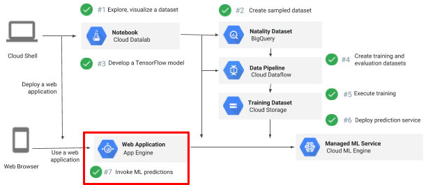

# Building an App Engine app to serve ML predictions


## Overview

*Duration is 1 min*


This lab is part of a lab series where you train, evaluate, and deploy a machine learning model to predict a baby's weight.

In this lab \#7, you build an app using Google App Engine with Flask. This will provide a front-end that will allow end users to interactively receive predictions from the deployed model.



### What you learn

In this lab, you will learn how to:

* Deploy a python Flask app as a App Engine web application
* Use the App Engine app to post JSON data, based on user interface input, to the deployed ML model and get predictions


## Setup


![[/fragments/start-qwiklab]]


## Start Cloud Shell


![[/fragments/cloudshell]]


## Copy trained model


### Step 1

Set necessary variables and create a bucket

```bash
REGION=us-central1
BUCKET=$(gcloud config get-value project)
TFVERSION=1.7

gsutil mb -l ${REGION} gs://${BUCKET}
```

### Step 2

Copy trained model into your bucket

```bash
gsutil -m cp -R gs://cloud-training-demos/babyweight/trained_model gs://${BUCKET}/babyweight
```


## Deploy trained model

### Step 1

Set necessary variables

```bash
MODEL_NAME=babyweight

MODEL_VERSION=ml_on_gcp

MODEL_LOCATION=$(gsutil ls gs://${BUCKET}/babyweight/export/exporter/ | tail -1)
```

### Step 2

Deploy trained model

```bash
gcloud ml-engine models create ${MODEL_NAME} --regions $REGION

gcloud ml-engine versions create ${MODEL_VERSION} --model ${MODEL_NAME} --origin ${MODEL_LOCATION} --runtime-version $TFVERSION
```


## Deploy App Engine app


### Step 1

Clone the course repository

```bash
cd ~

git clone https://github.com/GoogleCloudPlatform/training-data-analyst
```

### Step 2

Complete the TODOs in `/application/main.py` and `/application/templates/form.html`

```bash
cd training-data-analyst/courses/machine_learning/deepdive/06_structured/labs/serving
```

<aside class="warning"><p>Note: If you need more help, you may take a look at the complete solution by navigating to: training-data-analyst/courses/machine_learning/deepdive/06_structured/serving</p>
</aside>

### Step 3

Run the provided deployment script to create and deploy your App Engine app

```bash
./deploy.sh
```

<aside class="warning"><p>Note: Choose a region for App Engine when prompted</p>
</aside>

### Step 4

Once the `deploy.sh` script runs successfully and your App Engine app is deployed, go to the url `https://YOUR-PROJECT-ID.appspot.com` to start off with the web form front-end that will make calls through the App Engine app.

<aside class="warning"><p>Note: Replace YOUR-PROJECT-ID in the url with the project id for your GCP project</p>
</aside>


![[/fragments/endqwiklab]]

Last Tested Date: 31 January, 2019

Last Updated Date: 31 January, 2019

![[/fragments/copyright]]
