# Computing Time-Windowed Features in Cloud Dataprep


## Overview


In this lab you will ingest, transform, and analyze a taxi cab dataset using Google Cloud Dataprep. We will calculate key reporting metrics like the average number of passengers picked up in the past hour.

### What you learn

In this lab, you:

* Build a new Flow using Cloud Dataprep
* Create and chain transformation steps with recipes
* Running Cloud Dataprep jobs (Dataflow behind-the-scenes)

Cloud Dataprep is Google's self-service data preparation tool. In this lab, you will learn how to clean and enrich multiple datasets using Cloud Dataprep.


## Setup


![[/fragments/start-qwiklab]]


## Create a new Storage Bucket


*Skip this section if you already have a GCS Bucket*

#### Step 1

Open the __Google Cloud Console__ at  [console.cloud.google.com](http://console.cloud.google.com).

#### Step 2

Go to __Storage__ in the __Navigation menu__ (left-side navigation).

#### Step 3

Click __Create Bucket__ (or use an existing bucket).

#### Step 4

In the Create a bucket window that will appear, add a unique bucket name and leave the remaining settings at their default values.

#### Step 5

Click __Create__.

#### Step 6

You now have a Cloud Storage Bucket which we will be using to store raw data for ingestion into Google BigQuery later and for storing Cloud Dataprep settings.


## Create BigQuery Dataset to store Cloud Dataprep Output


#### Step 1

Open __BigQuery__ at  [https://console.cloud.google.com/bigquery](https://console.cloud.google.com/bigquery).

#### Step 2

In the left side bar, __click on your project__ name.

#### Step 3

Click __CREATE DATASET__.

#### Step 4

For Dataset ID, type __taxi_cab_reporting__ and select __Create dataset__.

Now you have a new empty dataset that we can populate with tables.


## Launch Cloud Dataprep


#### Step 1

Open the __Navigation menu__.

#### Step 2

Under Big Data, click on __Dataprep__.

#### Step 3

__Agree__ to the Terms of Service.

#### Step 4

Click __Agree and Continue__.

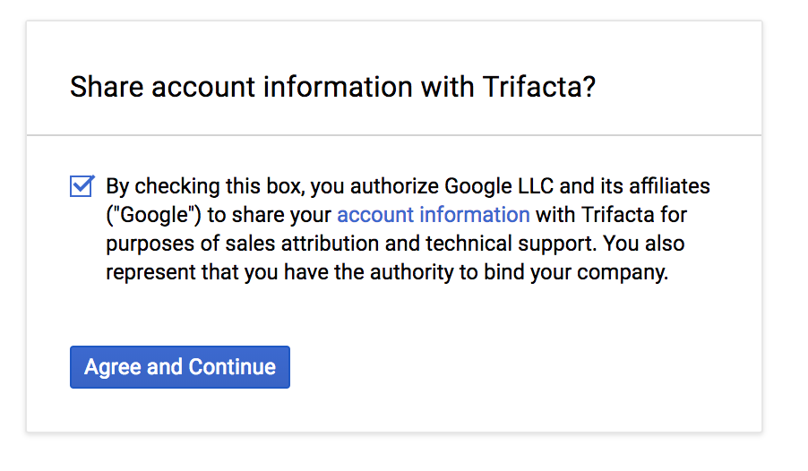

Click __Allow__ for Trifacta to access project data. Dataprep is provided in collaboration with Trifacta, a Google partner.
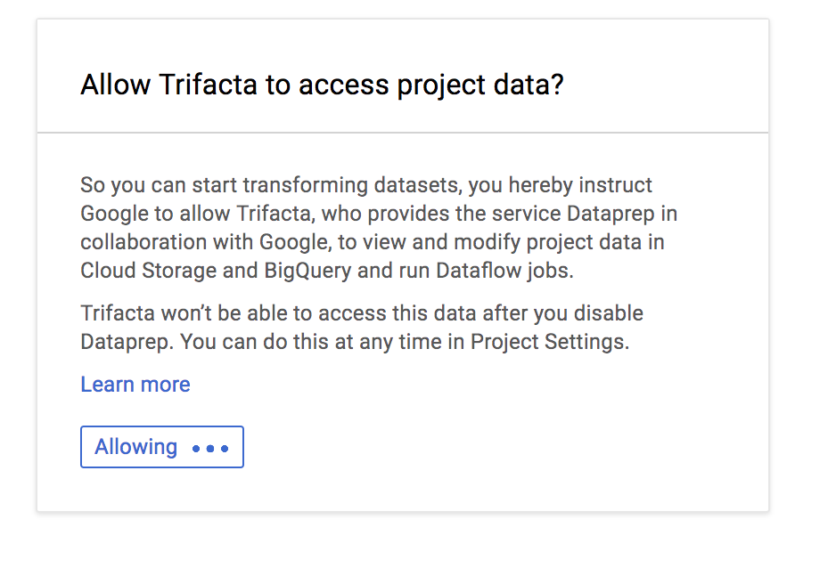

#### Step 5

Click __Allow__.

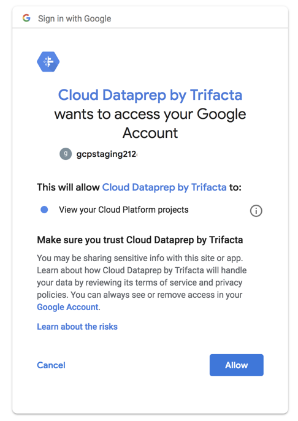

#### Step 6

When prompted for "First Time Setup", click __Continue__.

#### Step 7

Wait for Cloud Dataprep to initialize (less than a minute typically).


## Import NYC Taxi Data from GCS into a Dataprep Flow


#### Step 1

In the Cloud Dataprep UI, click __Create Flow__.

#### Step 2

Specify the following __Flow details:__

<table>
<tr><td colspan="1" rowspan="1"><p><strong>Flow Name</strong></p>
</td><td colspan="1" rowspan="1"><p><strong>Flow Description</strong></p>
</td></tr>
<tr><td colspan="1" rowspan="1"><p>NYC Taxi Cab Data Reporting</p>
</td><td colspan="1" rowspan="1"><p>Ingesting, Transforming, and Analyzing Taxi Data</p>
</td></tr>
</table>

Click __Create__.

If prompted, dismiss the helper tutorial.

#### Step 3

Click __Import & Add Datasets__.

#### Step 4

In the data importer left side menu, click __GCS (Google Cloud Storage)__.

#### Step 5

Click the __Pencil Icon__ to edit the GCS path.

#### Step 6

Paste in the 2015 taxi rides dataset CSV from Google Cloud Storage:

```bash
gs://cloud-training/gcpml/c4/tlc_yellow_trips_2015_small.csv
```

Click __Go__.

#### Step 7

Before selecting Import, click the Pencil Icon to __edit the GCS path__ a second time and paste in the 2016 CSV below:

```bash
gs://cloud-training/gcpml/c4/tlc_yellow_trips_2016_small.csv
```

Click __Go__.

#### Step 8

Click __Import & Add to Flow__.

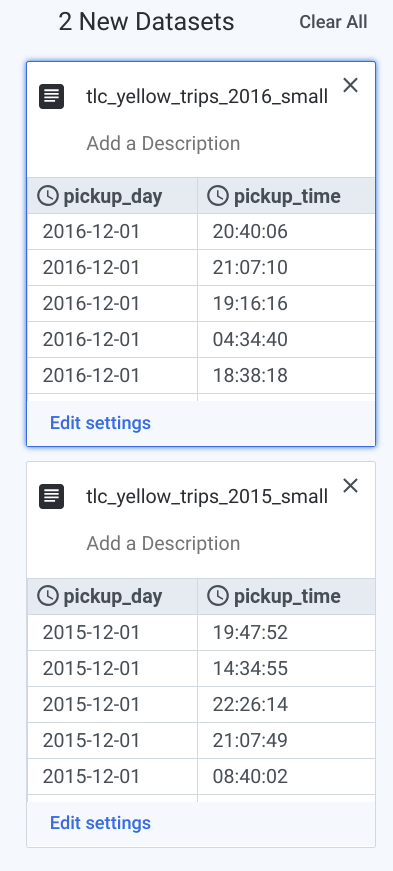

#### Step 9

__Wait__ for the datasets to be loaded into DataPrep.

The tool loads up to a 10MB sample of the underlying data as well as connects to and ingests the original data source when the flow is ran.

#### Step 10

Click on the __tlc\_yellow\_trips\_2015\_small__ icon and select __Add New Recipe__.

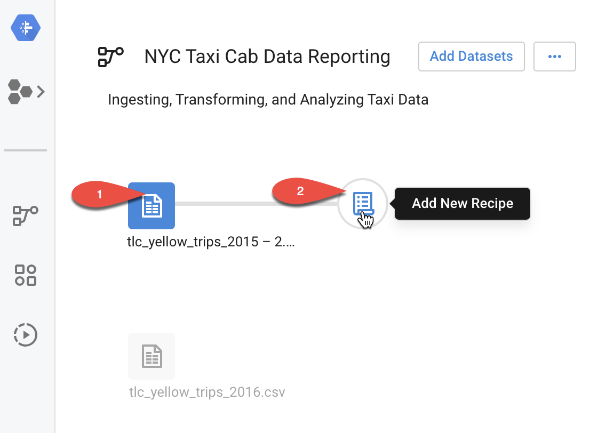

#### Step 11

Click __Edit Recipe__.

Wait for Dataprep to load your data sample into the explorer view

#### Step 12

In the explorer view, find the __trip_distance__ column and examine the histogram.

True or False, the majority of the cab rides for 2015 were less than 2 miles?


__True.__ In our sample, 57% were between 0 to 2 miles.

Now, let's combine our 2016 and 2015 datasets.

#### Step 13

In the navigation bar, find the icon for __Union__ and select it.

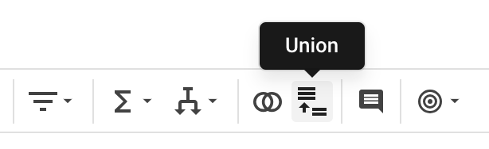

#### Step 14

In the Union Page, click __Add data__.

In the popup window, select __tlc\_yellow\_trips\_2016\_small__ and click __Apply__.

#### Step 15

Confirm the union looks like below (UNION DATA (2)) and then click __Add to Recipe__.

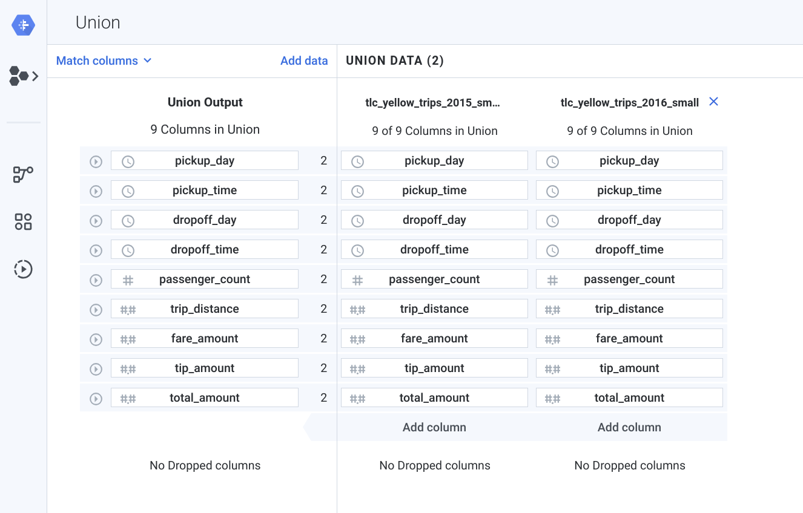

Wait for Dataprep to Apply the Union.

Now we have a single table with 2016 and 2015 taxicab data.

### __Exploring your Data__

#### Step 16

Examine the __pickup\_time__ histogram. Which hours had the fewest amount of pickups? The most?

In our sample, the early morning hours (5 - 6am) had the __fewest__ taxicab pickups.

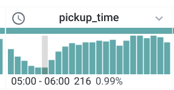

The most taxi cab pickups were in the evening hours with 21:00 (9pm) having slightly more than others.

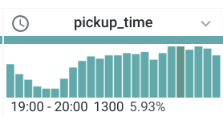

Is this unusual? Would you expect NYC taxi cab trips to be clustered around lunch and earlier hours in the day? Let's continue exploring.

Examine the __pickup\_day__ histogram. Which months and years of data do we have in our dataset?

* Only December 2015 and December 2016

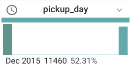

Examine the __dropoff\_day__ histogram. Is there anything unusual about it when compared to pickup\_day? Why are there records for January 2017?

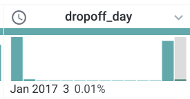

__Answer:__ There are a few trips that start in December and end in January (spending New Years in a taxicab!).

Next, we want to concatenate our date and time fields into a single timestamp.

#### Step 17

In the navigation bar, find __Merge columns__.

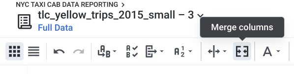

For columns to merge, specify __pickup\_day__ and __pickup\_time__.

For separator __type a single space__.

Name the new column __pickup\_datetime__.

Preview and click __Add__.

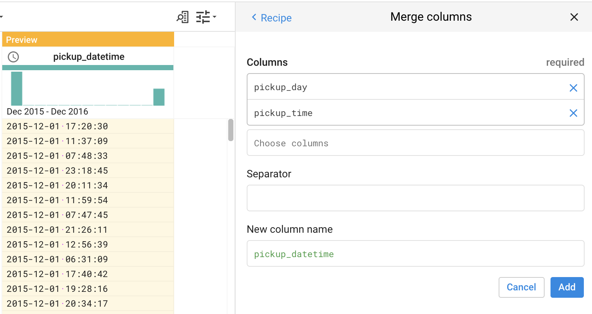

Confirm your new field is properly registering now as a datetime datatype (clock icon).

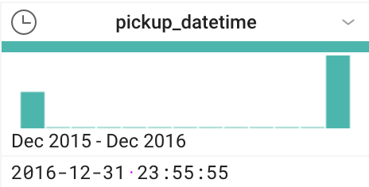

#### Step 18

Next, we want to __create a new derived column__ to count the average amount of passengers in the last hour. To do that, we need to create to get hourly data and perform a calculation.

Find the __Functions__ list in the navigation bar.

Select __Dates and times__.

Select __DATEFORMAT__.

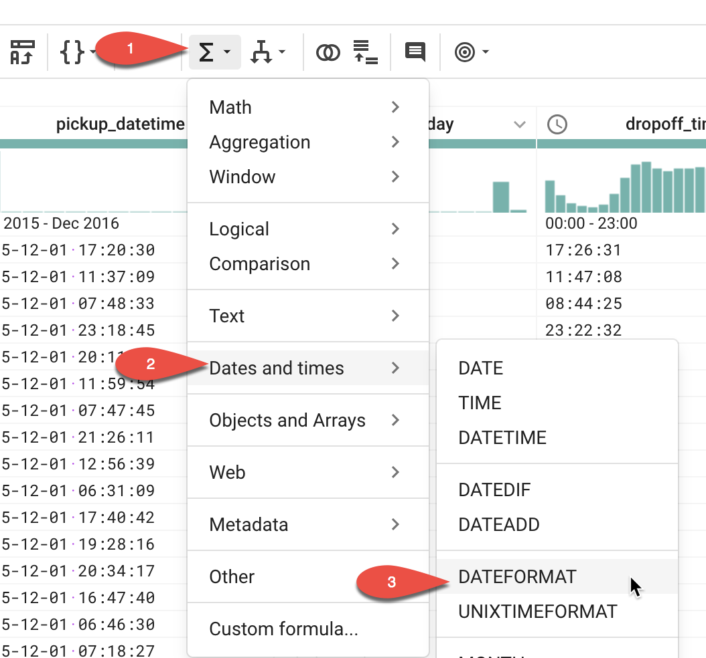

In the formula, paste the following which will truncate the pickup time to just the hour:

```bash
DATEFORMAT(pickup_datetime,"yyyyMMddHH")
```

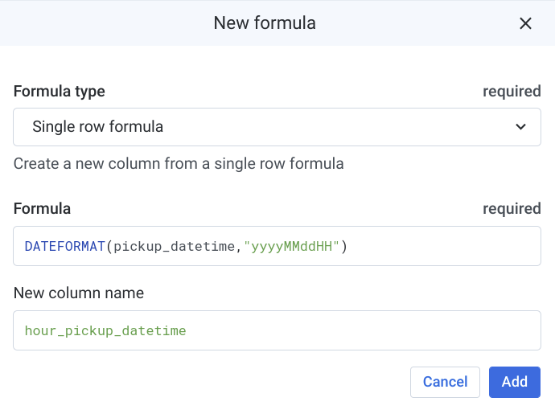

Specify the New Column as __hour\_pickup\_datetime__.

Confirm the new derived column is shown correctly in the __preview__.


Click __Add__.

#### Step 19

In order to get the field properly recognized as a DATETIME data type, we are going to add back zero minutes and zero seconds through a MERGE concatenation.

In the navigation bar, find __Merge columns__.


For columns to merge, specify __hour\_pickup\_datetime__ and __'0000'__.

Name the column to __pickup\_hour__.

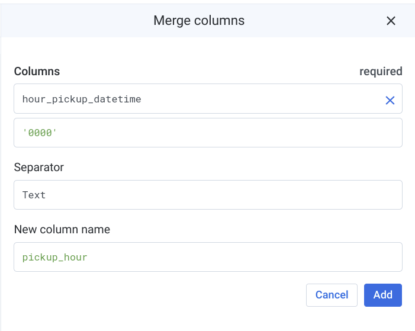

Click __Add__.

We now have our taxicab hourly pickup column. Next, we will calculate the average count of passengers over the past hour. We will do this through aggregations and a rolling window average function.

#### Step 20

In the navigation toolbar select __Functions__ \> __Aggregation__ \> __AVERAGE__.

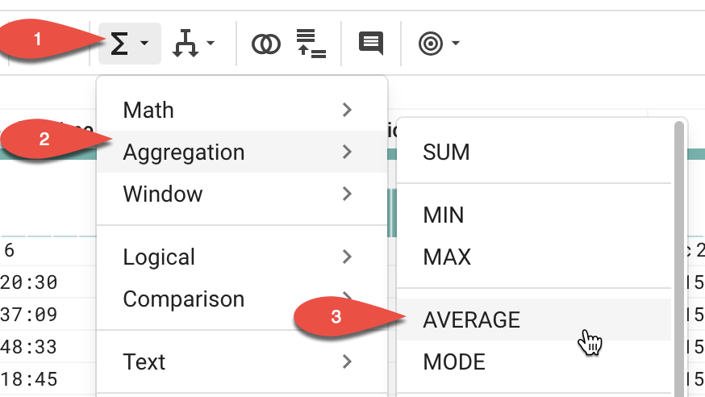

For __Formula__, specify:

```bash
AVERAGE(fare_amount)
```

For __Sort__ rows, specify:

```bash
pickup_datetime
```

For __Group by__, specify:

```bash
pickup_hour
```


Click __Add__.

We now have our average cab fares statistic.

#### Step 21

Explore the __average\_fare\_amount__ histogram. Is there a range of fares that are most common?

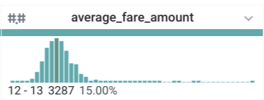

In our sample, most NYC cab fares are in the $12-13 range.

Next, we want to calculate a rolling window of average fares over the past 3 hours.

#### Step 22

In the navigation toolbar, select __Functions__ \> __Window__ \> __ROLLINGAVERAGE__.

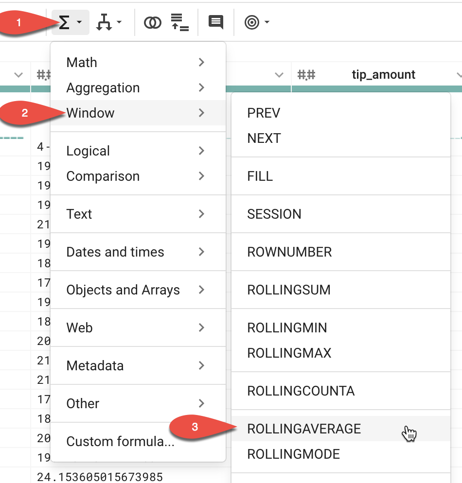

Copy in the below formula which computes the rolling average of passenger count for the last hour.

Formula:

```bash
ROLLINGAVERAGE(average_fare_amount, 3, 0)
```

Sort rows by:

```bash
-pickup_hour
```

Note that we are sorting recent taxicab rides first (the negative sign -__pickup\_hour__ indicates descending order) and operating over a rolling 3 hour period.

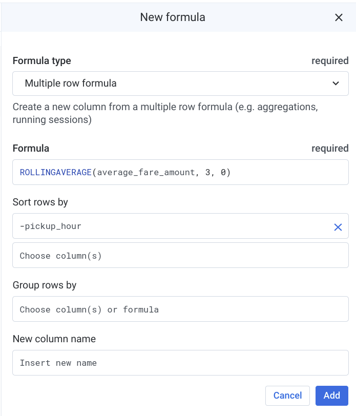

Click __Add__.

#### Step 23

Toggle open the __Recipe icon__ to preview your final transformation steps.

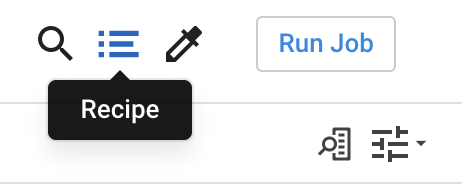

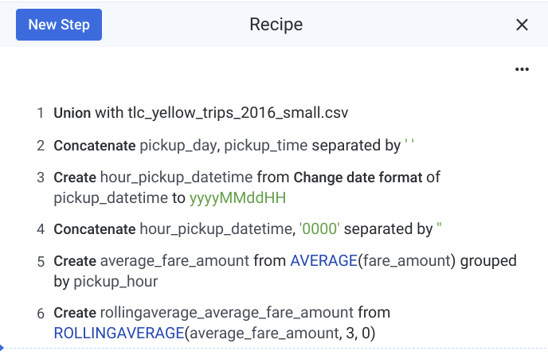

#### Step 24

Click __Run Job__.

#### Step 25

In __Publishing Actions page__, under Settings, edit the path by clicking the pencil icon

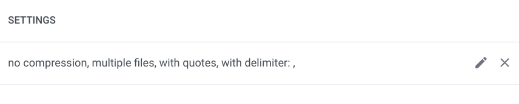

Choose __BigQuery__ and choose your __taxi\_cab\_reporting__ BigQuery dataset where you want to create the output table.

(__Note:__ if you do not see a taxi\_cab\_reporting dataset, refer to the start of this lab for instructions on how to create it in BigQuery)

Choose __Create a new table__.

Name the table __tlc\_yellow\_trips\_reporting__.

Choose __Drop the table every run__.

Select __Update__.

#### Step 26

Select __Run Job__.

#### Step 27

Optional: View the Cloud Dataflow Job by selecting \[...\] and __View dataflow job__.

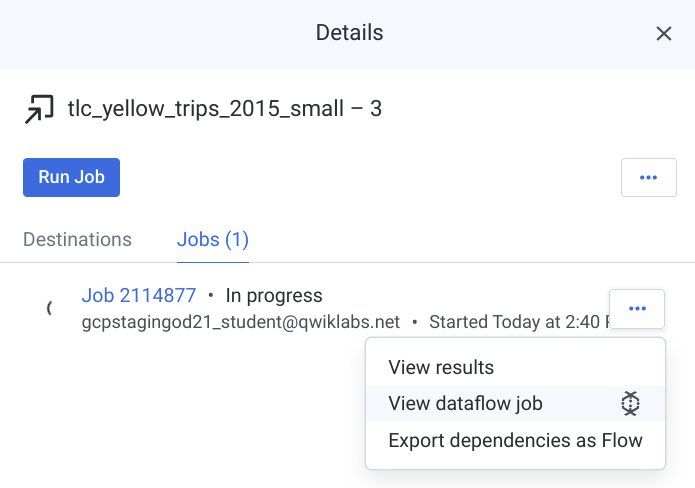

Wait for your Cloud Dataflow job to complete and confirm your new new table shows in BigQuery.

#### Step 28

While your Cloud Dataprep flow starts and manages your Cloud Dataflow job, you can see the data results by running this pre-ran query in BigQuery:

```sql
#standardSQL
SELECT
  pickup_hour,
  FORMAT("$%.2f",ROUND(average_3hr_rolling_fare,2)) AS avg_recent_fare,
  ROUND(average_trip_distance,2) AS average_trip_distance_miles,
  FORMAT("%'d",sum_passenger_count) AS total_passengers_by_hour
FROM
  `asl-ml-immersion.demo.nyc_taxi_reporting`
ORDER BY
  pickup_hour DESC;
```

Extra credit:

You can schedule Cloud Dataprep jobs to run at set intervals. Select a flow and click \[...\] and __Schedule Flow__.

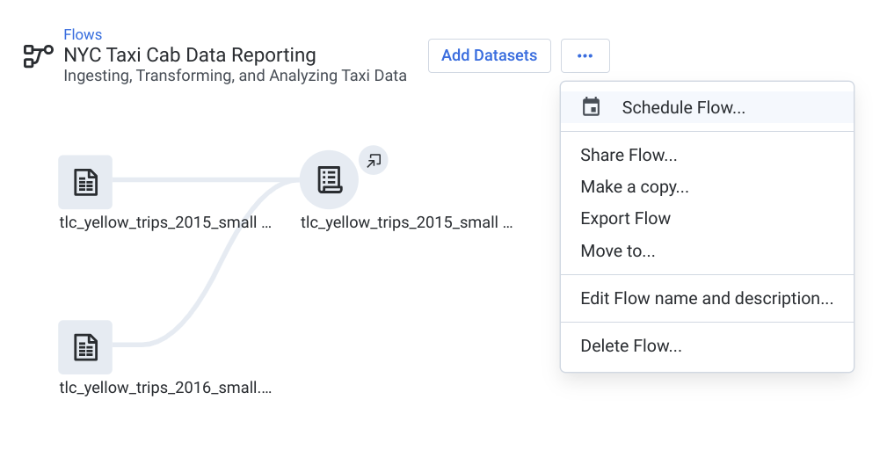

Congratulations! You have now built a data transformation pipeline using the Cloud Dataprep UI.

For full documentation and additional tutorials, refer to the  [Cloud Dataprep support page](https://cloud.google.com/dataprep/).

![[/fragments/endqwiklab]]

Last Tested Date: 12-05-2018

Last Updated Date: 12-05-2018

![[/fragments/copyright]]
