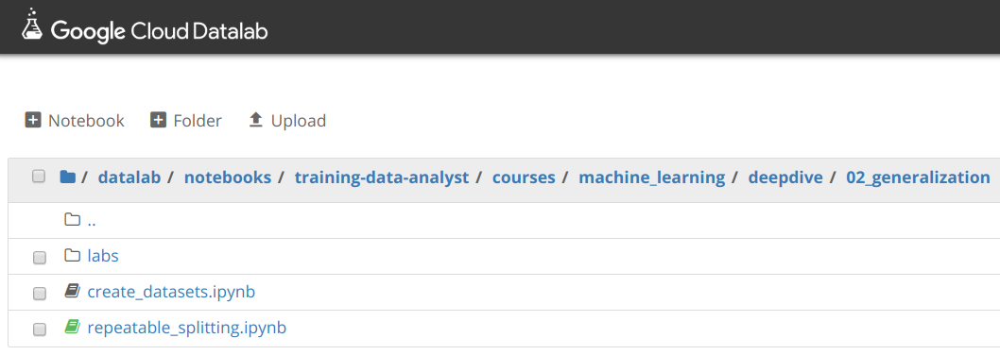

# Creating repeatable splits in BigQuery

## Overview

*Duration is 1 min*

Repeatability is important in machine learning. If you do the same thing now and 5 minutes from now and get different answers, then it makes experimentation is difficult. In other words, you will find it difficult to gauge whether a change you made has resulted in an improvement or not.

### What you need

* Logged into GCP Console with your Qwiklabs generated account

### What you learn

In this lab, you will:

* Explore the impact of different ways of creating machine learning datasets.

## Setup

![[/fragments/start-qwiklab]]

## Launch Cloud Datalab

![[/fragments/setup-datalab]]

## Clone course repo within your Datalab instance

![[/fragments/clone-repo-in-datalab]]

## Creating Repeatable Dataset splits

*Duration is 15 min*

__Step 1__

In Cloud Datalab, click on the __Home__ icon, and then navigate to __datalab \> notebooks \> training-data-analyst \> courses \> machine\_learning \> deepdive \> 02\_generalization__ and open __repeatable\_splitting.ipynb__.

This notebook is your cloned copy of the one in the course repository. Any code changes you make and run here are reflected only in your working copy (until you share with others). This way you can edit and run the code to practice the concepts.

<aside class="warning">
Note: If the cloud shell used for running the datalab command is closed or interrupted, the connection to your Cloud Datalab VM will terminate. If that happens, you may be able to reconnect using the command ‘<strong>datalab connect mydatalabvm</strong>&#39; in your new Cloud Shell. Once connected, try the above step again.

</aside>

__Step 2__

In Datalab, click on __Clear | Clear All Cells__. Now read the narrative and execute each cell in turn.

![[/fragments/endqwiklab]]

Last Tested Date: 12-03-2018

Last Updated Date: 12-18-2018

![[/fragments/copyright]]
