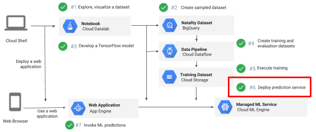

# Deploying and Predicting with Cloud ML Engine

## Overview

*Duration is 1 min*

This lab is part of a lab series where you train, evaluate, and deploy a machine learning model to predict a baby's weight.

In this lab, you deploy a trained model to Cloud ML Engine and send requests to it to get baby weight predictions.

### __What you learn__

In this lab, you will learn how to:

* deploy the trained model to act as a REST web service
* send a JSON request to the endpoint of the service to make it predict a baby's weight.

## Setup

![[/fragments/start-qwiklab]]

## Create Storage Bucket

*Duration is 2 min*

![[/fragments/create-bucket]]

## Launch Cloud Datalab

![[/fragments/setup-datalab]]

## Clone course repo within your Datalab instance

![[/fragments/clone-repo-in-datalab]]

## Deploy and predict with model

*Duration is 15 min*

__Step 1__

In Cloud Datalab, click on the __Home__ icon, and then navigate to __datalab \> notebooks \> training-data-analyst \> courses \> machine\_learning \> deepdive \> 06\_structured \> labs__ and open __6\_deploy.ipynb__.

<aside class="warning">
Note: If the cloud shell used for running the datalab command is closed or interrupted, the connection to your Cloud Datalab VM will terminate. If that happens, you may be able to reconnect using the command ‘<strong>datalab connect mydatalabvm</strong>&#39; in your new Cloud Shell. Once connected, try the above step again.

</aside>

__Step 2__

In Datalab, click on __Clear | Clear all Cells__. Now read the narrative and execute each cell in turn:

* If you notice sections marked "Lab Task", you will need to create a new code cell and write/complete code to achieve the task.
* Some lab tasks include starter code. In such cells, look for lines marked \#TODO.
* Hints may also be provided for the tasks to guide you along. Highlight the text to read the hints (they are in white text).
*  If you need more help, you may take a look at the complete solution by navigating to: __datalab \> notebooks \> training-data-analyst \> courses \> machine\_learning \> deepdive \> 06\_structured__ and open: __6\_deploy.ipynb__

<aside class="warning">
Note: when doing copy/paste of python code, please be careful about indentation

</aside>

![[/fragments/endqwiklab]]

Last Tested Date: 12-11-2018

Last Updated Date: 12-18-2018

![[/fragments/copyright]]
