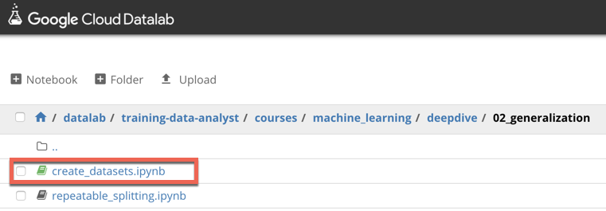

# Exploring and creating ML datasets

## Overview

*Duration is 1 min*

This lab is part of a lab series, where you go from exploring a taxicab dataset to training and deploying a high-accuracy distributed model with Cloud ML Engine.

### What you need

* Logged into GCP Console with your Qwiklabs generated account

### What you learn

In this lab, you will:

* explore a dataset using BigQuery and Datalab
* sample the dataset and create training, validation, and testing datasets for local development of TensorFlow models
* create a benchmark to evaluate the performance of ML against

## Setup

![[/fragments/start-qwiklab]]

## Launch Cloud Datalab

![[/fragments/setup-datalab]]

## Clone course repo within your Datalab instance

![[/fragments/clone-repo-in-datalab]]

## Explore dataset, create ML datasets, create benchmark

*Duration is 15 min*

### Step 1

In Cloud Datalab, click on the __Home__ icon, and then navigate to __datalab \> notebooks \> training-data-analyst \> courses \> machine\_learning \> deepdive \> 02\_generalization \> labs__ and open __create\_datasets.ipynb__.

This notebook is your cloned copy of the one in the course repository. Any code changes you make and run here are reflected only in your working copy (until you share with others). This way you can edit and run the code to practice the concepts.

<aside class="warning">
Note: If the cloud shell used for running the datalab command is closed or interrupted, the connection to your Cloud Datalab VM will terminate. If that happens, you may be able to reconnect using the command ‘<strong>datalab connect mydatalabvm</strong>&#39; in your new Cloud Shell. Once connected, try the above step again.

</aside>

### Step 2

In Datalab, click on __Clear | Clear all Cells__. Now read the narrative and execute each cell in turn.

![[/fragments/endqwiklab]]

Last Tested Date: 12-03-2018

Last Updated Date: 12-18-2018

![[/fragments/copyright]]
