# Getting Started with Dialogflow

## Overview

This lab shows you how to build a simple Dialogflow agent, walking you through the most important features of Dialogflow. You'll learn how to:

*  [Create a Dialogflow account](https://dialogflow.com/docs/getting-started/create-account) and  [your first Dialogflow agent](https://dialogflow.com/docs/getting-started/first-agent), which lets you define a natural language understanding model.

## Setup

![[/fragments/start-qwiklab]]

## Create your Dialogflow account

This section describes how to create and log in to a Dialogflow account

### Create your Dialogflow account

Now that you're signed into your Qwiklabs student account in an incognito (private browser) window, you can sign into Dialogflow  [here](https://console.dialogflow.com/api-client/\#/login) by following these steps:

1. Click __Google__. 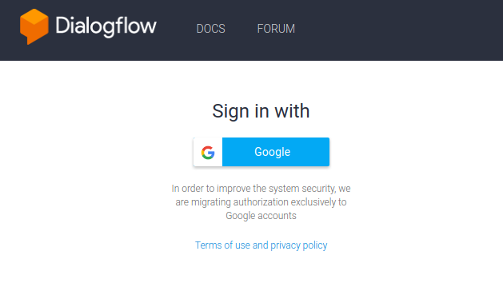
2. Be sure to sign in with your Qwiklabs account
3. Allow Dialogflow to access your Google account.  [See a list of the permissions and what they're used for](https://dialogflow.com/docs/concepts/permissions).

Lastly, you'll be taken to Dialogflow's terms of service, which you'll need to accept in order to use Dialogflow.

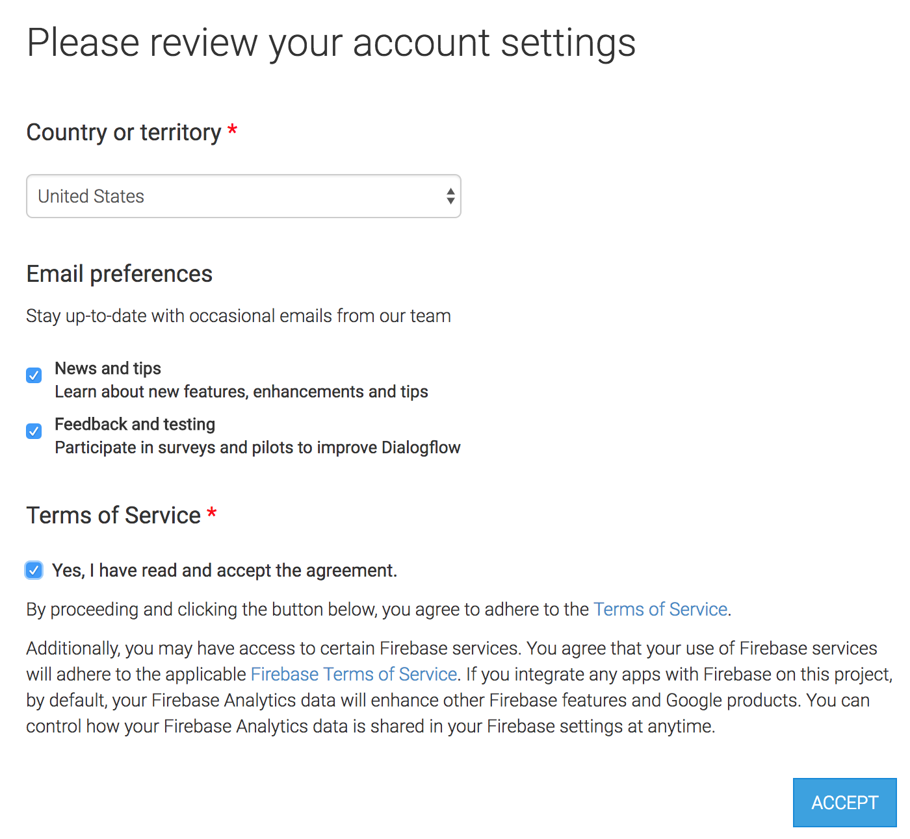

### Next steps

Next, you'll create your first Dialogflow agent and test it out.

## Create and query your first agent

This section describes how to create and try out your first Dialogflow agent.

__Note:__ Before you start, make sure you've  [created a Dialogflow account](https://dialogflow.com/docs/getting-started/create-account).

### Create your first Dialogflow agent

To create a Dialogflow agent:

1. Open a browser and  [log in to Dialogflow](https://console.dialogflow.com/api-client/\#/login).
2. Click __Create agent__ in the left menu.

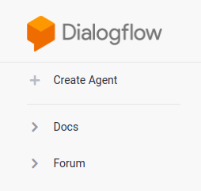

3. Enter your agent's name, default language, and default time zone.

4. For the __GOOGLE PROJECT__, click on the drop-down arrow button and select your assigned __qwiklabs project ID__, then click the __Create__ button.

### The Dialogflow console

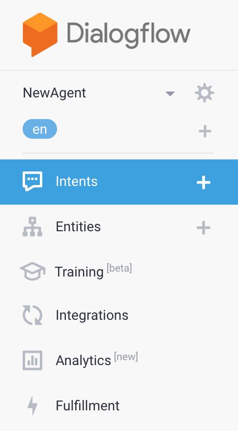

You should now see the Dialogflow console and the menu panel on the left. If you're working on a smaller screen and the menu is hidden, click on the menu button in the upper left corner. The settings button takes you to the current  [agent's settings](https://dialogflow.com/docs/agents\#settings).

The middle of the page will show the list of intents for the agent. By default, Dialogflow agents start with two intents. Your agent matches the __Default Fallback Intent__ when it doesn't understand what your users say. The __Default Welcome Intent__ greets your users. These can be altered to customize the experience.

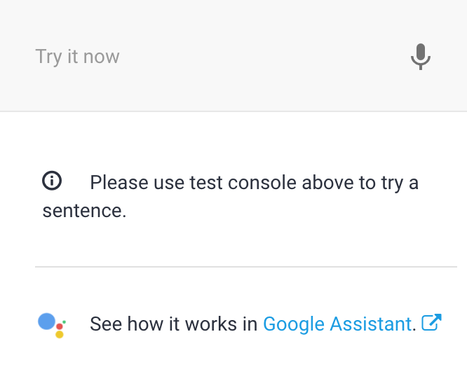

On the right is the Dialogflow simulator. This lets you try out your agent by speaking or typing messages.

### Query your agent

Agents are best described as NLU (Natural Language Understanding) modules. These can be included in your app, product, or service and transform natural user requests into actionable data.

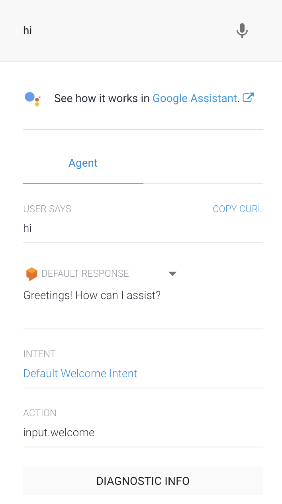

Time to try out your agent! In the __Dialogflow simulator__ on the right, click into the text field that says __Try it now__, type __hi__, and press enter.

You just spoke to your Dialogflow agent! You may notice your agent understood you. Since your input matched to the Default Welcome Intent, you received one of the default replies inside the welcome intent.

In the case that your agent doesn't understand you, the Default Fallback Intent is matched and you receive one of the default replies inside that intent.

The Default Fallback Intent reply prompts the user to reframe their query in terms that can be matched. You can change the responses within the Default Fallback Intent to provide example queries and guide the user to make requests that can match an intent.

### Create your first intent

Dialogflow uses intents to categorize a user's intentions. Intents have __Training Phrases__, which are examples of what a user might say to your agent. For example, someone wanting to know the name of your agent might ask, "What is your name?", "Do you have a name?", or just say "name". All of these queries are unique but have the same intention: to get the name of your agent.

To cover this query, create a "name" intent:

1. 1. Click on the __+__ icon next to __Intents__ in the left menu.
2. Add the name "name" into the __Intent name__ text field.
3. In the __Training Phrases__ section, click __Add Training Phrases__ enter the following, pressing enter after each entry:

  * What is your name?
  * Do you have a name?
  * name

4. In the __Responses__ section, click __Add Response__ enter the following response:

* My name is Dialogflow!

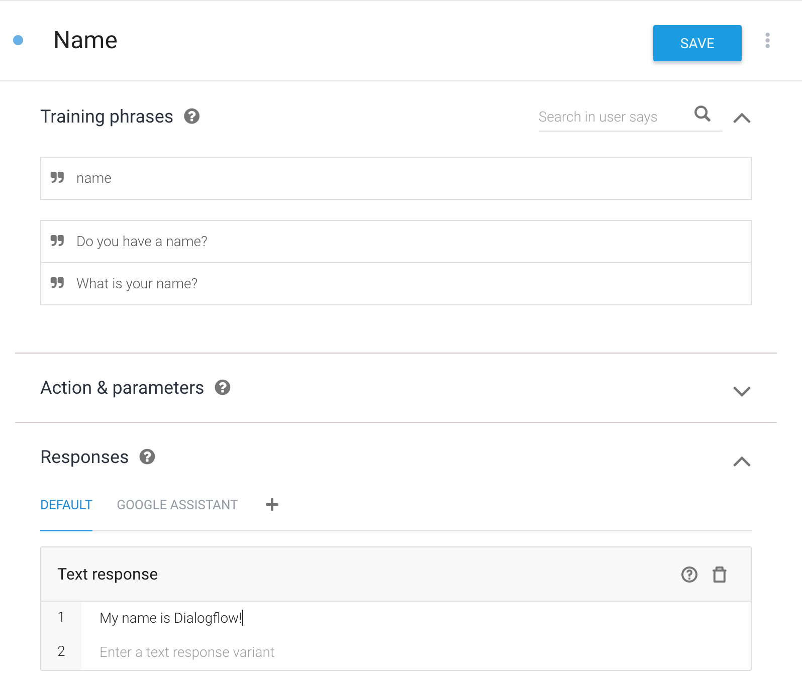
5. Click the __Save__ button.

#### Try it out!

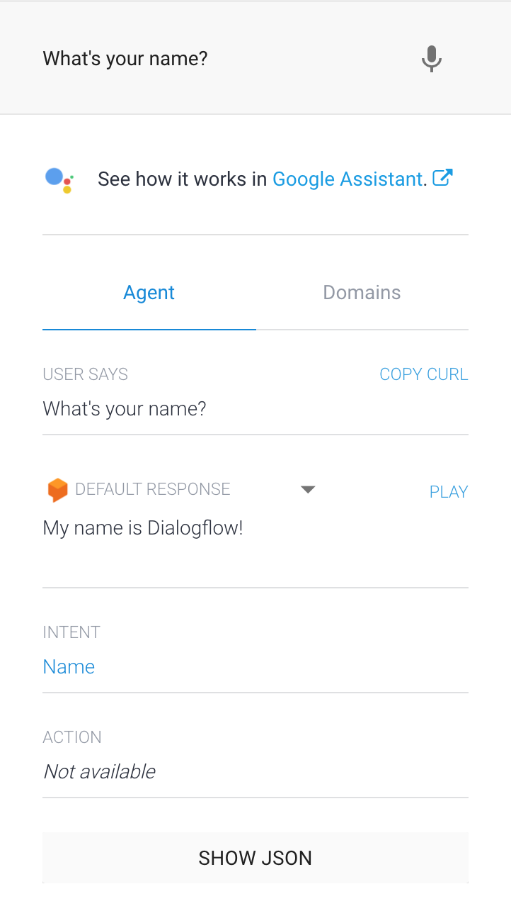

Now try asking your agent for its name. In the simulator on the right, type "What's your name?" and press enter.

Your agent now responds to the query correctly. Notice that even though your query was a little different from the training phrase ("What's your name?" versus "What is your name?"), Dialogflow still matched the query to the right intent.

Dialogflow uses training phrases as examples for a machine learning model to match users' queries to the correct intent. The  [machine learning](https://dialogflow.com/docs/agents/machine-learning) model checks the query against every intent in the agent, gives every intent a score, and the highest-scoring intent is matched. If the highest scoring intent has a very low score, the fallback intent is matched.

## Extract data with entities

This section describes how to extract data from a user's query.

### Add parameters to your intents

Parameters are important and relevant words or phrases in a user's query that are extracted so your agent can provide a proper response. You'll create a new intent with parameters for spoken and programming languages to explore how these can match specific intents and be included in your responses.

1. Create a new intent by clicking on the __+__ icon next to __Intents__ in the left menu.
2. Name the intent "Languages" at the top of the intent page.
3. Add the following as Training phrases:

  * I know English
  * I speak French
  * I know how to write in German

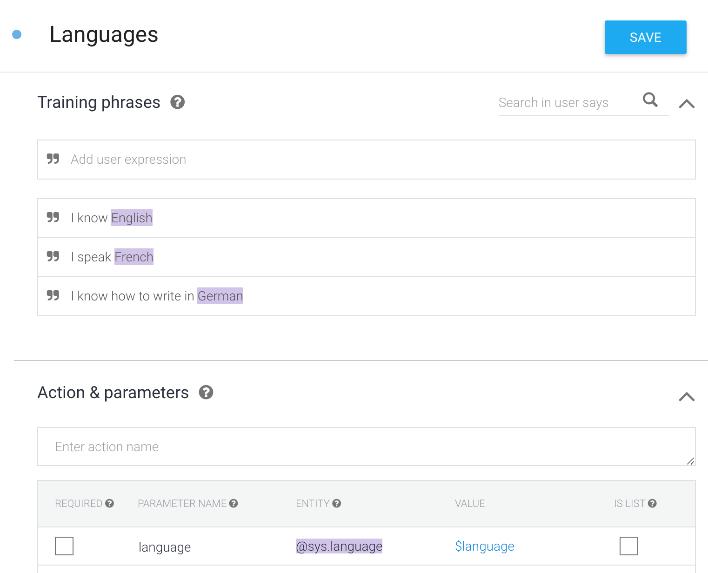

Dialogflow automatically detects known parameters in your Training phrases and creates them for you.

Below the __Training phrases__ section, Dialogflow fills out the parameter table with the information it gathered:

* The parameter is optional (not required)
* named language
* corresponds to the  [system entity](https://dialogflow.com/docs/entities\#system\_entities) type  [@sys.language](https://dialogflow.com/docs/reference/system-entities\#other)
* has the value of $language
* is not a  [list](https://dialogflow.com/docs/actions-and-parameters\#is\_list)

__Note:__ If entities aren't automatically detected, you can highlight the text in the Training phrase and  [manually annotate the entity](https://dialogflow.com/docs/intents\#manual\_annotation).

### Use parameter data

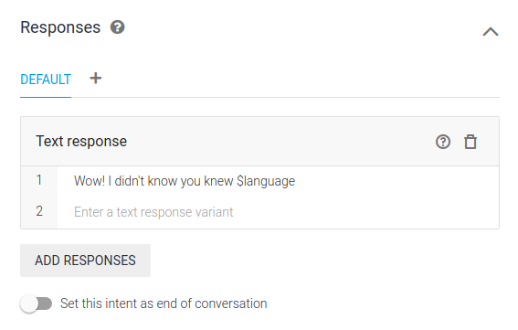

The value of a parameter can be used in your responses. In this case, you can use $language in your responses and it will be replaced with the language specified in the query to your agent.

4. In the __Responses__ section, add the following response and click the __Save__ button:

* Wow! I didn't know you knew $language

#### Try it out!

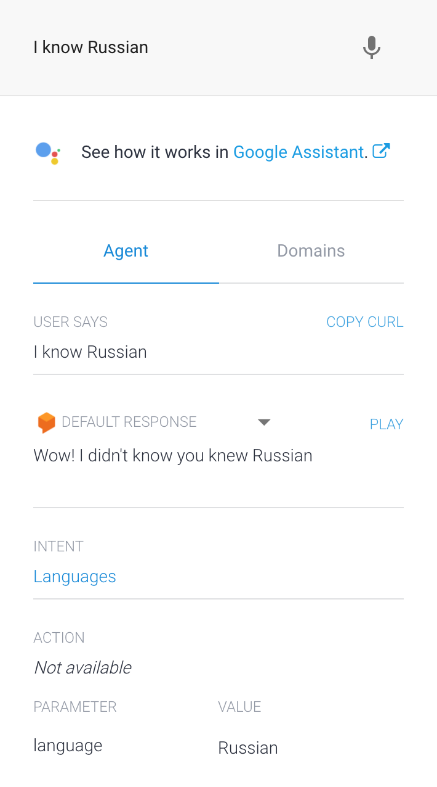

Now, query your agent with "I know Russian" in the simulator in the right panel.

You can see in the bottom of the simulator output that Dialogflow correctly extracted the language parameter with the value "Russian" from the query. In the response, you can see "Russian" was correctly inserted where the parameter value was used.

### Create your own entities

You can also create your own entities, which function similarly to Dialogflow's system entities.

To create an entity:

1. Click on the __+__ icon next to __Entities__ in the left menu.
2. Enter "ProgrammingLanguage" for the name of the entity.
3. Click on the text field and add the following entries:

  * JavaScript
  * Java
  * Python

4. When you enter an entry, pressing tab moves your cursor into the synonym field. Add the following synonyms for each entry:
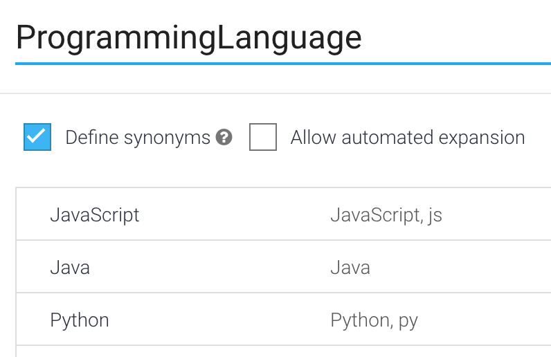Click the __Save__ button.

Each entity type has to have the following:

* a name to define the category (ProgrammingLanguage)
* one or more entries (JavaScript)
* one or more synonyms (js, JavaScript)

Dialogflow can handle simple things like plurality and capitalization, but make sure to add all possible synonyms for your entries. The more you add, the better your agent can determine your entities.

### Add your new entities

Now that we've defined our entity for programming languages, add Training Phrases to the "Languages" intent:

1. Click on __Intents__ in the left menu, and then click on the "Languages" intent.
2. Add the following as Training phrases:
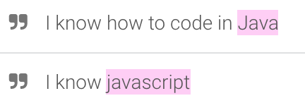

* I know javascript
* I know how to code in Java

3. You should see the programming languages automatically annotated in the Training phrases you entered. This adds the ProgrammingLanguage parameter to the table, which is below the __Training phrases__ section.  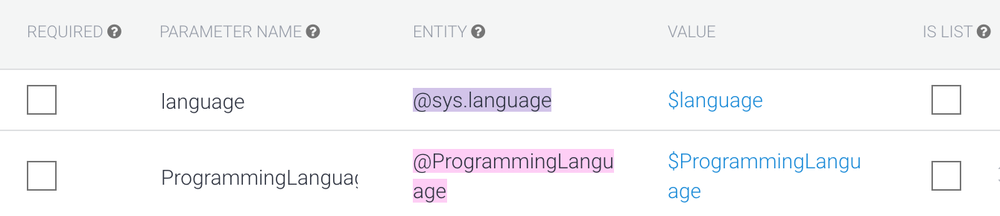 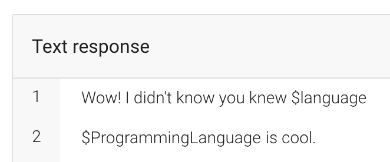
4. In the __Responses__ section, add "$ProgrammingLanguage is cool" and then click the __Save__ button.

#### Try it out!

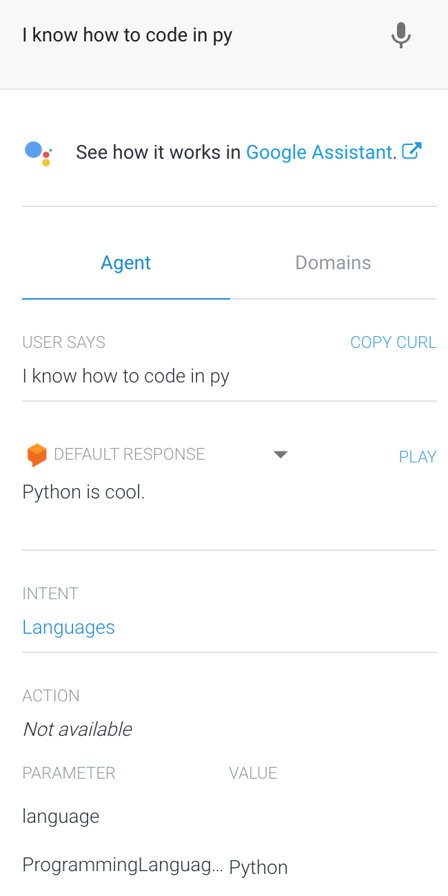

## Manage state with contexts

This section describes how to track conversational states with follow-up intents and contexts.

### Add contexts to conversational state

1. Click on __Intents__ in the left menu, and then click on the "Languages" intent.
2. Extend one of the original Text response in the __Response__ section to the following:

* Wow! I didn't know you knew $language. How long have you known $language?

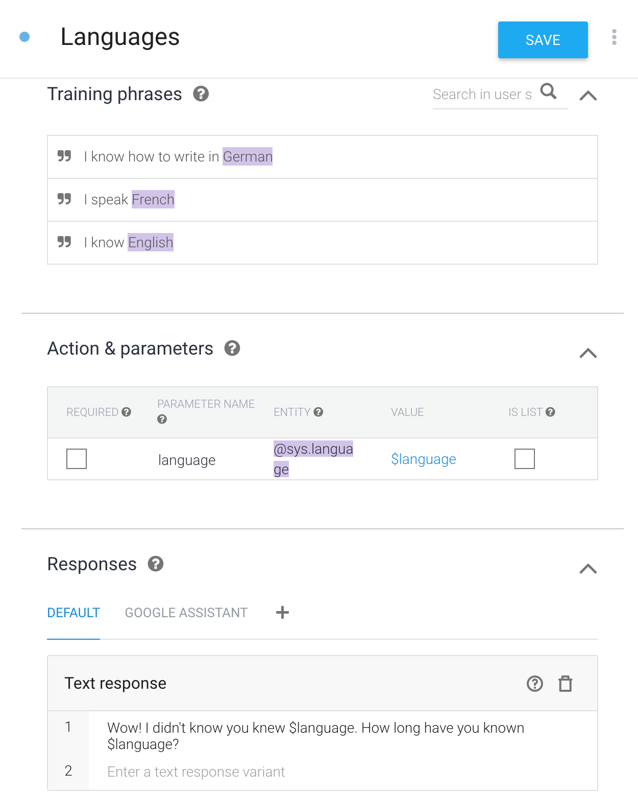

3. Click the __Save__ button.

4. Click on __Intents__ in the left menu.

5. Hover over the "Languages" intent and click on __Add follow-up intent__:

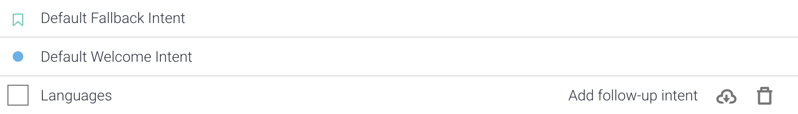

6. Click on __Custom__ in the revealed list:  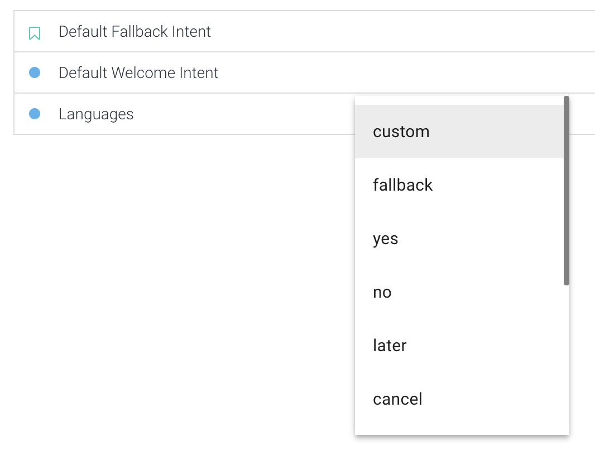

Dialogflow automatically names the follow-up intent "Languages - custom", and the arrow indicates the relationship between the intents.

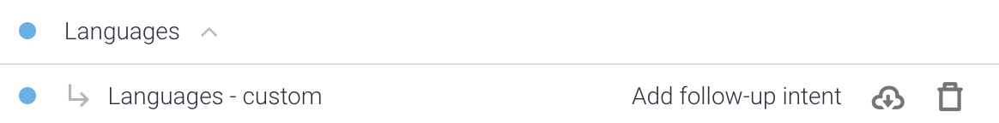

### Intent matching with follow-up intents

Follow-up intents are only matched after the parent intent has been matched. Since this intent is only matched after the "Languages" intent, we can assume that the user has just been asked the question "How long have you known $language?". You'll now add Training Phrases indicating users' likely answers to that question.

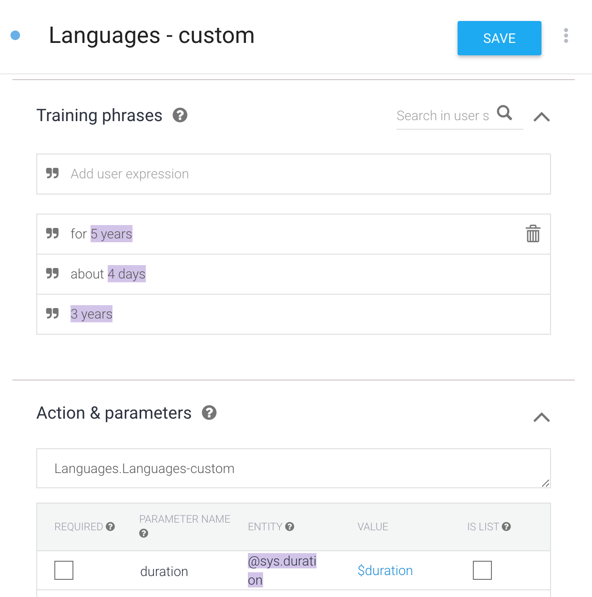

1. Click on __Intents__ in the left menu and then click on the "Languages - custom" intent.
2. Add the following Training Phrases:

* 3 years
* about 4 days
* for 5 years

3. Click the __Save__ button.

### Try it out

Try this out in the __Dialogflow simulator__ on the right. First, match the "Languages" intent by entering the query I know French. Then, answer the question How long have your known $language? with about 2 weeks.

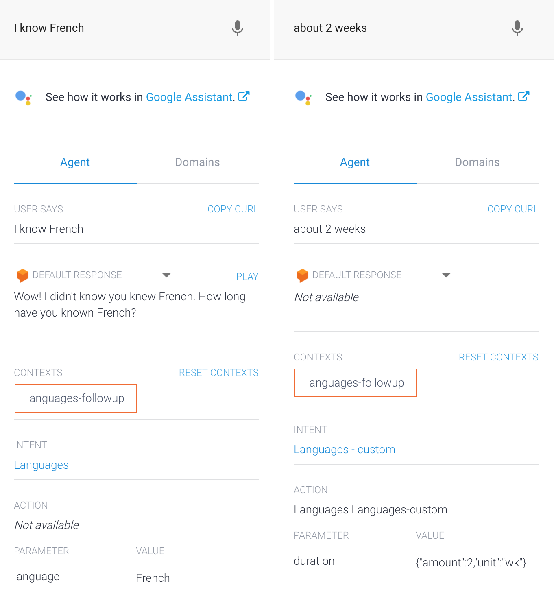

Despite there being no response for the second query ("about 2 weeks"), we can see our query is matched to the correct intent ("Languages - custom") and the duration parameter is correctly parsed ("2 weeks").

### Intents and contexts

Now that your follow-up intent is being matched correctly, you need to add a response. In "Languages - custom" you've only asked for the duration the user has known the language, and not the referenced language itself.

To respond with a parameter gathered from the "Languages" intent, you need to know how follow-up intents work. Follow-up intents use contexts to keep track of if a parent intent has been triggered. If you inspect the "Languages" intent, you'll see "Languages-followup" listed as an __Output context__, prefaced by the number 2:

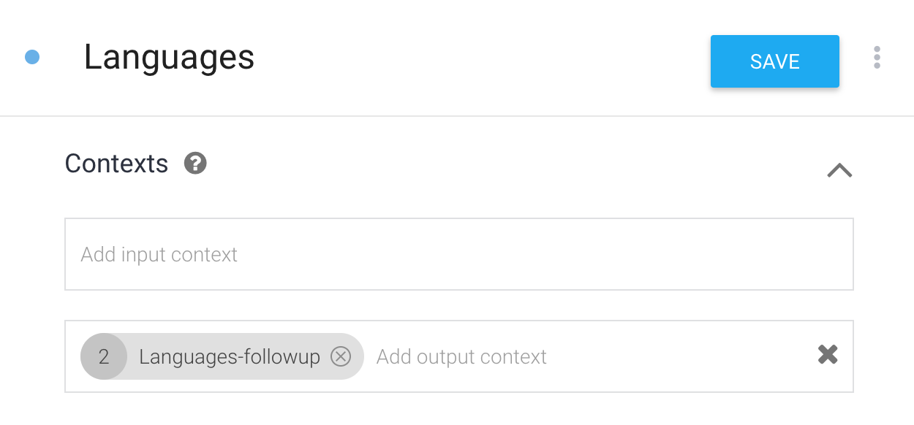

After the "Languages" intent is matched, the context "Languages-followup" is attached to the conversation for two turns. Therefore, when the user responds to the question, "How long have you known $language?", the context "Languages-followup" is active. Any intents that have the same __Input context__ are heavily favored when Dialogflow matches intents.

1. Click on __Intents__ in the left navigation and then click on the "Languages - custom" intent.

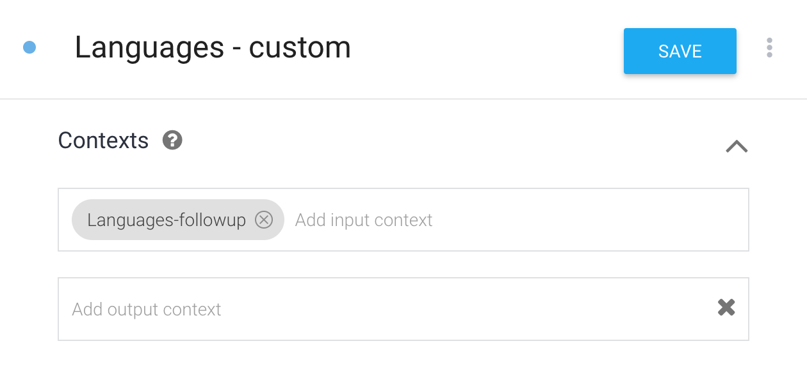

You can see that the intent has the same input context ("Languages-followup") as the output context of "Languages". Because of this, "Languages - custom" is much more likely to be matched after the "Languages" intent is matched.

### Contexts and parameters

Contexts store parameter values, which means you can access the values of parameters defined in the "Languages" intent in other intents like "Languages - custom".

1. Add the following response to the "Languages - custom" intent and click the __Save__ button:

* I can't believe you've known \#languages-followup.language for $duration!

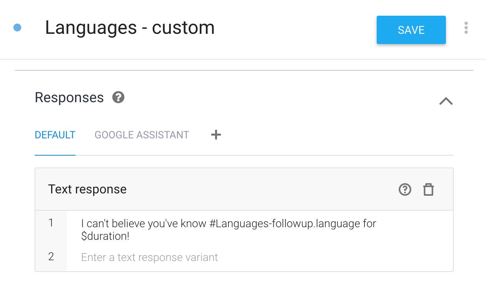

__Save__ the changes. Now you can query your agent again and get the proper response. First enter "I know French", and then respond to the question with "1 month".

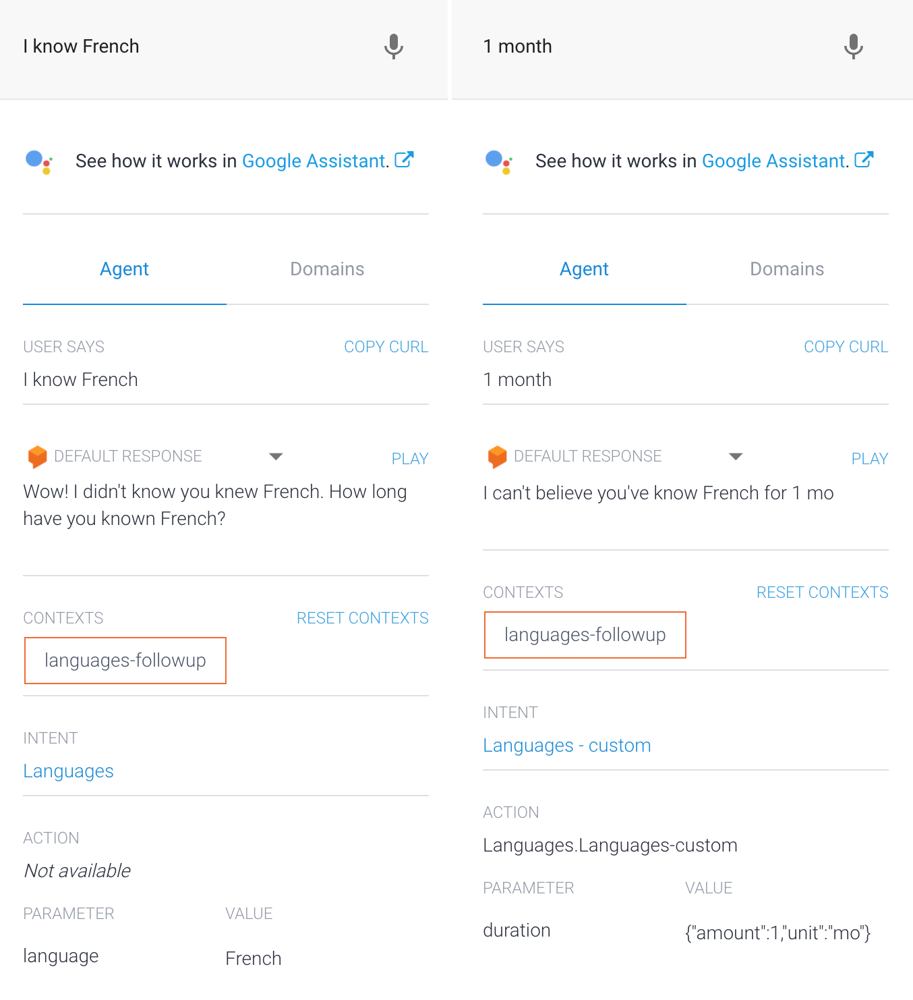

You should see that the language parameter value is retrieved from the context.

### Next steps

If you have any questions or thoughts, let us know on the  [Dialogflow Google Plus Community](https://plus.google.com/communities/103318168784860581977). We'd love to hear from you!

Now that you've completed your first agent, you can extend your response logic with fulfillment and consider which additional platforms you want to support via Dialogflow's one-click integrations.

Fulfillment allows you to provide programmatic logic behind your agent for gathering third-party data or accessing user-based information.

*  [Fulfillment](https://dialogflow.com/docs/fulfillment)
*  [How to get started with fulfillment](https://dialogflow.com/docs/how-tos/getting-started-fulfillment)
*  [Integrate your service with fulfillment](https://dialogflow.com/docs/getting-started/integrate-services)
*  [Integrate your service with Actions on Google](https://dialogflow.com/docs/getting-started/integrate-services-actions-on-google)

Dialogflow's integrations make your agent available on popular platforms like Facebook Messenger, Slack and Twitter.

*  [Integrations Overview](https://dialogflow.com/docs/integrations/)
*  [Facebook Messenger](https://dialogflow.com/docs/integrations/facebook)
*  [Slack](https://dialogflow.com/docs/integrations/slack)
*  [Twitter](https://dialogflow.com/docs/integrations/twitter)

You might also want to check out:

*  [Contexts](https://dialogflow.com/docs/contexts)
*  [Dialogflow and Actions on Google](https://dialogflow.com/docs/getting-started/dialogflow-actions-on-google)

![[/fragments/endqwiklab]]

Manual Last Updated: May 16, 2019

Lab Last Tested: May 16, 2019

![[/fragments/copyright]]
