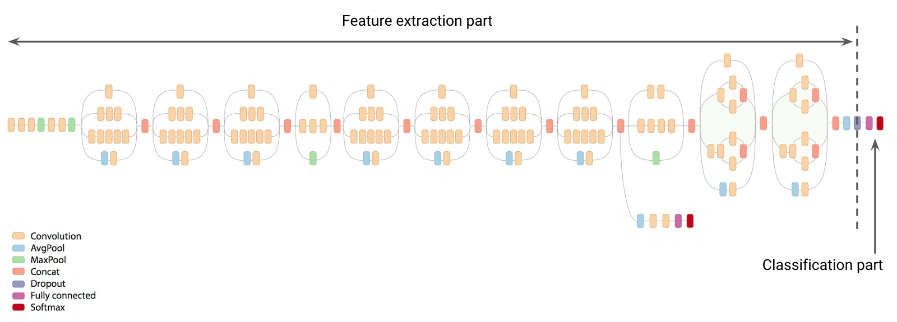
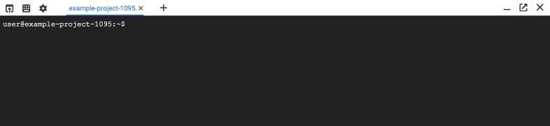
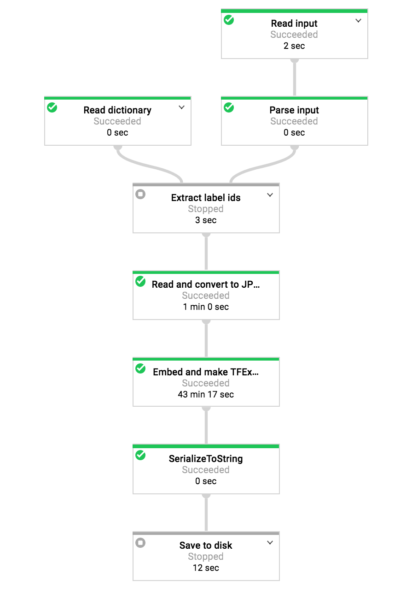
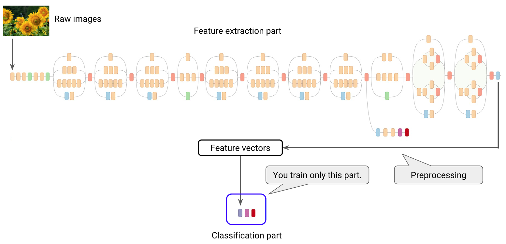

# Image Classification Transfer Learning with Inception v3


## Overview


In this lab, you carry out a transfer learning example based on Inception-v3 image recognition neural network.

### __What you learn__

* How a transfer learning works
* How to use Cloud Dataflow for a batch processing of image data
* How to use Cloud ML to train a classification model
* How to use Cloud ML to provide a prediction API service


## Introduction

*Duration is 2 min*


Transfer learning is a machine learning method which utilizes a pre-trained neural network. For example, the image recognition model called  [Inception-v3](https://arxiv.org/abs/1512.00567) consists of two parts:

* Feature extraction part with a convolutional neural network.
* Classification part with fully-connected and softmax layers.

The pre-trained Inception-v3 model achieves state-of-the-art accuracy for recognizing general objects with 1000 classes, like "Zebra", "Dalmatian", and "Dishwasher". The model extracts general features from input images in the first part and classifies them based on those features in the second part.



In transfer learning, when you build a new model to classify your original dataset, you reuse the feature extraction part and re-train the classification part with your dataset. Since you don't have to train the feature extraction part (which is the most complex part of the model), you can train the model with less computational resources and training time.

## Setup

*Duration is 5 min*

![[/fragments/start-qwiklab]]

## Requirements


### Step 1: Confirm that needed APIs are enable.

In the GCP Console, on the __Navigation menu__ (), click __APIs & Services__ > __Library__.

Search for the below APIs by name and click on __ENABLE__ button if necessary.

* Cloud Machine Learning Engine
* Dataflow API


### Step 2: Launch CloudShell

Open the __cloud shell__. The cloud shell icon is at the top right:


A cloud shell session will open inside a new frame at the bottom of your browser.



### Step 3: Install Cloud ML SDK

Install Cloud ML SDK, and modify the PATH.

```bash
sudo pip install apache-beam[gcp]
sudo pip install image
export PATH=${HOME}/.local/bin:${PATH}
```

### Step 4: Download tutorial files

Download tutorial files and set your current directory.

```bash
git clone https://github.com/GoogleCloudPlatform/cloudml-samples
cd cloudml-samples/flowers
```


## Learn the Dataset

*Duration is 2 min*


[Sunflowers](https://www.flickr.com/photos/calliope/1008566138/) *by Liz West is licensed under* [CC BY 2.0](https://creativecommons.org/licenses/by/2.0/)

You have about 3,600 flower images with five categories. The five category labels are listed in the dictionary file ( [dict.txt](https://storage.cloud.google.com/cloud-ml-data/img/flower\_photos/dict.txt)) as below:

```bash
daisy
dandelion
roses
sunflowers
tulips
```

This file is used to translate labels into internal ID numbers in the following processes such as daisy=0, dandelion=1, etc.

The images are randomly split into a training set with 90% data and an evaluation set with 10% data. Each of them are listed in CSV files:

* Training set:  [train\_set.csv](https://storage.cloud.google.com/cloud-ml-data/img/flower\_photos/train\_set.csv)
* Evaluation set:  [eval\_set.csv](https://storage.cloud.google.com/cloud-ml-data/img/flower\_photos/eval\_set.csv)

The CSV files have the following format consisting of image URIs and labels:

```bash
gs://cloud-ml-data/img/flower_photos/dandelion/17388674711_6dca8a2e8b_n.jpg,dandelion
gs://cloud-ml-data/img/flower_photos/sunflowers/9555824387_32b151e9b0_m.jpg,sunflowers
gs://cloud-ml-data/img/flower_photos/daisy/14523675369_97c31d0b5b.jpg,daisy
gs://cloud-ml-data/img/flower_photos/roses/512578026_f6e6f2ad26.jpg,roses
gs://cloud-ml-data/img/flower_photos/tulips/497305666_b5d4348826_n.jpg,tulips
...
```

You input these images into the feature extraction part of Inception-v3 which converts the image data into feature vectors consisting of 2048 float values for each image. A feature vector represents the features of the image in an abstract manner. You can better classify images based on these vector values rather than raw image data.


## Preprocess Images with Cloud Dataflow

*Duration is 54 min*


### Preprocess the Evaluation Set

You use Cloud Dataflow to automate the feature extraction process. First, you do it for the evaluation dataset.

#### Step 1

Set variables to specify the output path and the dictionary file on Cloud Storage.

```bash
DICT_FILE=gs://cloud-ml-data/img/flower_photos/dict.txt
PROJECT=$(gcloud config list project --format "value(core.project)")
BUCKET="gs://${PROJECT}-flower"
GCS_PATH="${BUCKET}/${USER}"
```

#### Step 2

Create a bucket for the output files and submit a Cloud Dataflow job to process the evaluation set.

```bash
gsutil mb $BUCKET
python trainer/preprocess.py \
  --input_dict "$DICT_FILE" \
  --input_path "gs://cloud-ml-data/img/flower_photos/eval_set.csv" \
  --output_path "${GCS_PATH}/preproc/eval" \
  --cloud \
  --num_workers 5
```

In the GCP Console, on the __Navigation menu__ (), click __Dataflow__, you find the running job and the link navigates to the data flow graph as below:



<aside class="warning"><p><strong>Note</strong>: The job takes around 10-15 minutes (depending on the environment) to finish. You can proceed with the next subsection to process the training set in parallel.</p>
</aside>

### Preprocess the Training Set

Since the job takes some time to finish, click __+__  symbol to open a new tab in the cloud shell and submit another job to process the training set in parallel.

#### Step 3

Set your current directory in the new tab.

```bash
cd $HOME/cloudml-samples/flowers
```

#### Step 4

Set variables to specify the output path and the dictionary file on Cloud Storage.

```bash
DICT_FILE=gs://cloud-ml-data/img/flower_photos/dict.txt
PROJECT=$(gcloud config list project --format "value(core.project)")
BUCKET="gs://${PROJECT}-flower"
GCS_PATH="${BUCKET}/${USER}"
```

#### Step 5

Submit a Cloud Dataflow job to process the training set.

```bash
python trainer/preprocess.py \
  --input_dict "$DICT_FILE" \
  --input_path "gs://cloud-ml-data/img/flower_photos/train_set.csv" \
  --output_path "${GCS_PATH}/preproc/train" \
  --cloud \
  --num_workers 5
```

<aside class="warning"><p><strong>Note</strong>: The whole process takes around 10 to 15 minutes (depending on the environment) to finish. Please wait for both jobs to finish successfully.</p>
</aside>

### Confirm the Preprocessed Files

When both jobs finished, the preprocessed files are stored in the following storage paths.

#### Step 6

Confirm that preprocessed files for the evaluation set are created.

```bash
gsutil ls "${GCS_PATH}/preproc/eval*"
```

You see the following files are stored in Cloud Storage.

```bash
gs://<Your project ID>-flower/enakai/preproc/eval-00000-of-00043.tfrecord.gz
gs://<Your project ID>-flower/enakai/preproc/eval-00001-of-00043.tfrecord.gz
gs://<Your project ID>-flower/enakai/preproc/eval-00002-of-00043.tfrecord.gz
...
```

#### Step 7

Confirm that preprocessed files for the training set are created.

```bash
gsutil ls "${GCS_PATH}/preproc/train*"
```

You see the following files are stored in Cloud Storage.

```bash
gs://<Your project ID>-flower/enakai/preproc/train-00000-of-00062.tfrecord.gz
gs://<Your project ID>-flower/enakai/preproc/train-00001-of-00062.tfrecord.gz
gs://<Your project ID>-flower/enakai/preproc/train-00002-of-00062.tfrecord.gz
...
```


## Train the Model with Cloud ML

*Duration is 15 min*


The next step is to train the classification part of the model using the preprocessed data. The following diagram shows the relationship between the preprocessing and the training.



#### Step 1

Submit a Cloud ML job to train the classification part of the model:

```bash
JOB_ID="flowers_${USER}_$(date +%Y%m%d_%H%M%S)"
gcloud ml-engine jobs submit training "$JOB_ID" \
  --module-name trainer.task \
  --package-path trainer \
  --staging-bucket "$BUCKET" \
  --region us-central1 \
  -- \
  --output_path "${GCS_PATH}/training" \
  --eval_data_paths "${GCS_PATH}/preproc/eval*" \
  --train_data_paths "${GCS_PATH}/preproc/train*" \
  --label_count 5
```

<aside class="warning"><p><strong>Note</strong>: <code>JOB_ID</code> can be arbitrary but you cannot reuse the same one.</p>
</aside>

#### Step 2

In the __Navigation menu__ (), click __AI Platform__ > __Jobs__ on the Cloud Console, find the running job and  navigate to the __Logs__ > __View Logs__ to see log messages. The training process takes about 10 minutes. After 1000 training steps, you see the messages as below:

```bash
INFO    2016-12-28 14:19:19 +0900       master-replica-0                Eval, step 1000:
INFO    2016-12-28 14:19:19 +0900       master-replica-0                - on train set 0.005, 1.000
INFO    2016-12-28 14:19:19 +0900       master-replica-0                -- on eval set 0.248, 0.937
INFO    2016-12-28 14:19:20 +0900       master-replica-0                Exporting prediction graph to gs://<Your project ID>-flower/<USER>/training/model
```

This means the model achieved 100% accuracy for the training set and 93.7% accuracy for the evaluation set. (The final accuracy may vary in each training.) The last message indicates that the whole model including the feature extraction part is exported so that you can use the model to classify new images without preprocessing them.


## Deploy the Trained Model for Predictions

*Duration is 10 min*


### Deploy the Trained Model

You deploy the exported model to provide a prediction API.

#### Step 1

Create a prediction API with the specified model name.

```bash
MODEL_NAME=flowers
gcloud ml-engine models create ${MODEL_NAME} --regions=us-central1
```

<aside class="warning"><p><strong>Note</strong>: <code>MODEL_NAME</code> can be arbitrary but you cannot reuse the same one.</p>
</aside>

#### Step 2

Create and set a default version of the model with the specified version name.

```bash
VERSION_NAME=v1
gcloud ml-engine versions create \
  --origin ${GCS_PATH}/training/model/ \
  --model ${MODEL_NAME} \
  ${VERSION_NAME}
gcloud ml-engine versions set-default --model ${MODEL_NAME} ${VERSION_NAME}
```

<aside class="warning"><p><strong>Note</strong>: <code>VERSION_NAME</code> can be arbitrary but you cannot reuse the same one. The last command is not necessary for the first version since it automatically becomes the default. It&#39;s here as a good practice to set the default explicitly.</p>
</aside>

<aside class="warning"><p><strong>Important</strong>: It may take a few minutes for the deployed model to become ready. Until it becomes ready, it returns 503 error.</p>
</aside>

### Create a JSON Request File

Now you can send an image data to get a classification result. First, you need to convert raw image files into a JSON request file.

#### Step 3

Download two sample images.

```bash
gsutil cp gs://cloud-ml-data/img/flower_photos/tulips/4520577328_a94c11e806_n.jpg flower1.jpg
gsutil cp gs://cloud-ml-data/img/flower_photos/roses/4504731519_9a260b6607_n.jpg flower2.jpg
```

#### Step 4

Convert the raw images to a single JSON request file.

```bash
python -c 'import base64, sys, json; \
  img = base64.b64encode(open(sys.argv[1], "rb").read()); \
  print json.dumps({"key":"1", "image_bytes": {"b64": img}})' \
  flower1.jpg > request.json
python -c 'import base64, sys, json; \
  img = base64.b64encode(open(sys.argv[1], "rb").read()); \
  print json.dumps({"key":"2", "image_bytes": {"b64": img}})' \
  flower2.jpg >> request.json
```

In this example, the following images are encoded in base64 and stored in a dictionary associated with key values 1 and 2 respectively.

   

### Send a Request to the Prediction API

#### Step 5

Use the gcloud command to send a request.

```bash
gcloud ml-engine predict --model ${MODEL_NAME} --json-instances request.json
```

The command returns the prediction result as below:

```bash
KEY  PREDICTION  SCORES
1    4           [1.5868581115796587e-08, 5.666522540082042e-08, 3.1425850011146395e-06, 3.0022348496139273e-10, 0.9999967813491821, 8.086380454130904e-09]
2    3           [0.00016239925753325224, 0.007603001315146685, 0.2902684807777405, 0.6873179078102112, 0.01457294262945652, 7.533563621109352e-05]
```

The returned message shows the key value, prediction and scores. You can use the key value to associate the result with the input image. The prediction is shown in the internal ID as explained in Learn the Dataset section. 4 and 3 correspond to tulips and sunflowers respectively. So the prediction for the second image is incorrect in this example.

You can see more details in scores which show the estimated probabilities for each category. For the first image, the score for ID 4 is almost 1.0. On the other hand, for the second image, the score for ID 3 (sunflowers) is about 0.69 whereas the score for ID 2 (roses) is about 0.29. Compared to the first image, you can see that the prediction for the second image is more uncertain.


## Conclusion

*Duration is 1 min*


### What we've covered

* How a transfer learning works
* How to use Cloud Dataflow for a batch processing of image data
* How to use Cloud ML to train a classification model
* How to use Cloud ML to provide a prediction API service

![[/fragments/endqwiklab]]

Manual last Updated: june 12, 2019

Lab Last Tested: june 12, 2019

![[/fragments/copyright]]
