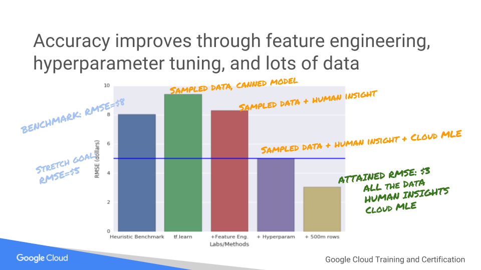

# Improve ML model with Feature Engineering

## Overview

*Duration is 1 min*

This lab is part of a lab series, where you go from exploring a taxicab dataset to training and deploying a high-accuracy distributed model with Cloud ML Engine.

### __What you learn__

In this lab, you will improve the ML model using feature engineering. In the process, you will learn how to:

* Work with feature columns
* Add feature crosses in TensorFlow
* Read data from BigQuery
* Create datasets using Dataflow
* Use a wide-and-deep model

## Setup

![[/fragments/start-qwiklab]]

## Create Storage Bucket

*Duration is 2 min*

![[/fragments/create-bucket]]

## Launch Cloud Datalab

![[/fragments/setup-datalab]]

## Clone course repo within your Datalab instance

![[/fragments/clone-repo-in-datalab]]

## Feature Engineering

*Duration is 15 min*

__Step 1__

In Cloud Datalab, click on the __Home__ icon, and then navigate to __datalab \> notebooks \> training-data-analyst \> courses \> machine\_learning \> deepdive \> 04\_features \> taxifeateng__ and open __feateng.ipynb__.

<aside class="warning">
<strong>Note</strong>: If the cloud shell used for running the datalab command is closed or interrupted, the connection to your Cloud Datalab VM will terminate. If that happens, you may be able to reconnect using the command ‘<strong>datalab connect mydatalabvm</strong>&#39; in your new Cloud Shell. Once connected, try the above step again.

</aside>

__Step 2__

In Datalab, click on __Clear | Clear all Cells__. Now read the narrative and execute each cell in turn.

The solution video will demo notebooks that contain hyper-parameter tuning and training on 500 million rows of data. The changes to the model are minor -- essentially just command-line parameters, but the impact on model accuracy is huge:

![[/fragments/endqwiklab]]

Last Tested Date: 12-06-2018

Last Updated Date: 12-18-2018

![[/fragments/copyright]]
