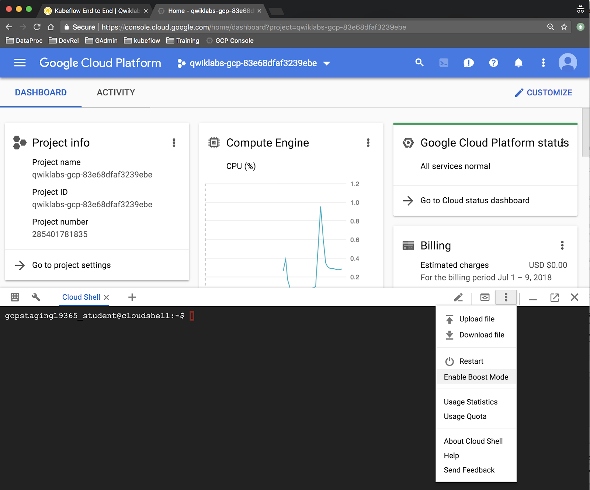
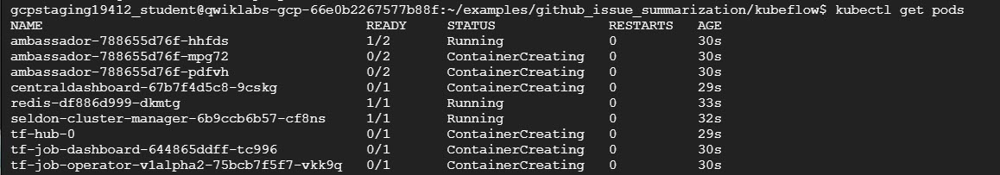
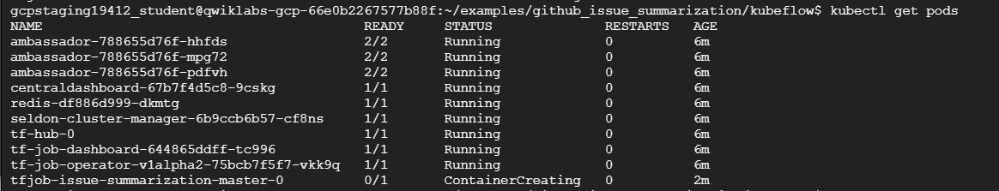
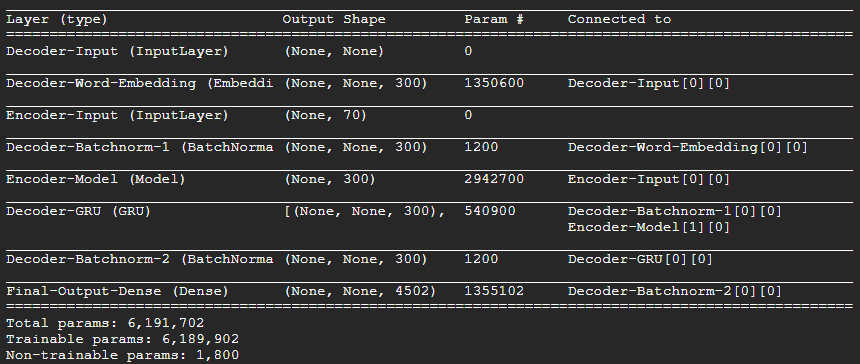
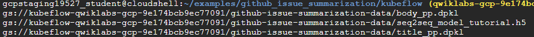
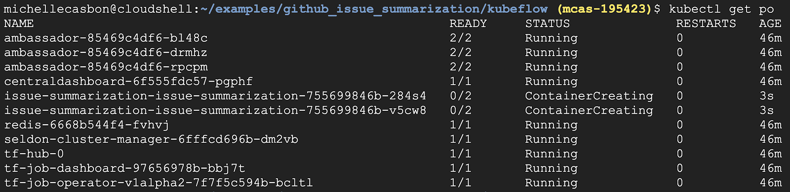
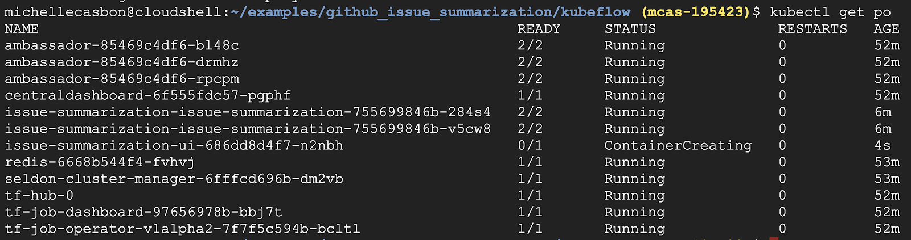
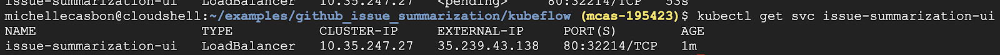
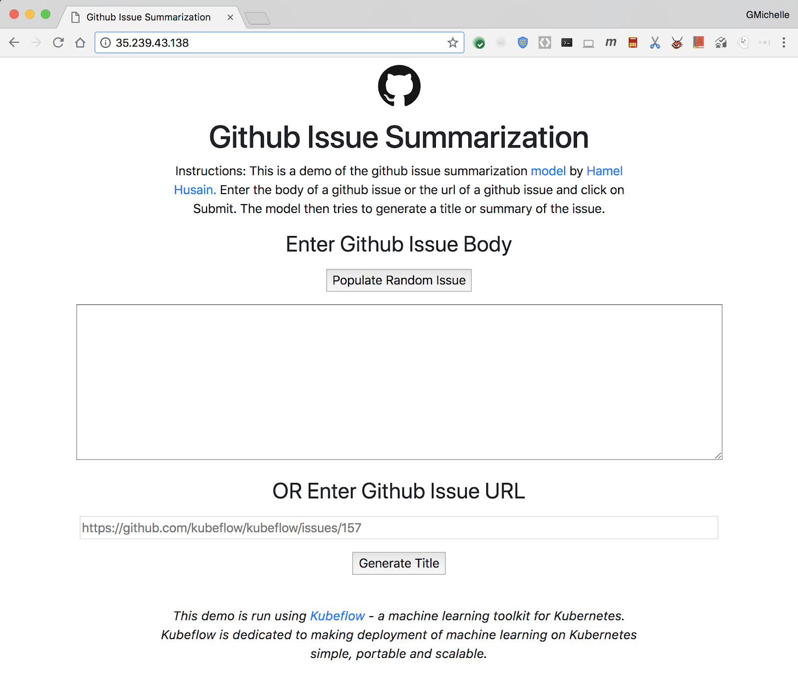
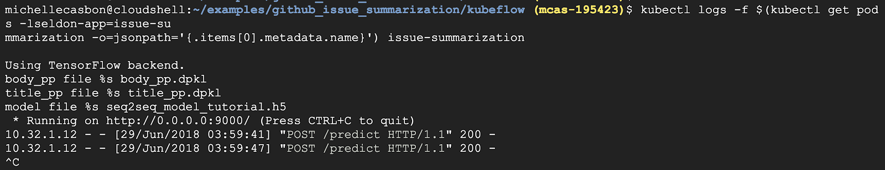

# Kubeflow End to End


## Introduction


[Kubeflow](https://www.kubeflow.org/) is a machine learning toolkit for  [Kubernetes](https://kubernetes.io/). The project is dedicated to making __deployments__ of machine learning (ML) workflows on Kubernetes simple, portable, and scalable. The goal is to provide a straightforward way to deploy best-of-breed open-source systems for ML to diverse infrastructures.

A Kubeflow deployment is:

* __Portable__ - Works on any Kubernetes cluster, whether it lives on Google Cloud Platform (GCP), on-premise, or across providers.
* __Scalable__ - Can utilize fluctuating resources and is only constrained by the number of resources allocated to the Kubernetes cluster.
* __Composable__ - Enhanced with service workers to work offline or on low-quality networks

Kubeflow will let you organize loosely-coupled microservices as a single unit and deploy them to a variety of locations, whether that's a laptop or the cloud. This codelab will walk you through creating your own Kubeflow deployment.

### What you'll build

In this lab you're going to build a web app that summarizes GitHub issues using a trained model. Upon completion, your infrastructure will contain:

* A GKE cluster with standard Kubeflow and Seldon Core installations
* A training job that uses Tensorflow to generate a Keras model
* A serving container that provides predictions
* A UI that uses the trained model to provide summarizations for GitHub issues

### What you'll learn

* How to install  [Kubeflow](https://github.com/kubeflow/kubeflow)
* How to run training using the  [Tensorflow](https://www.tensorflow.org/) job server to generate a  [Keras](https://keras.io/) model
* How to serve a trained model with  [Seldon Core](https://github.com/SeldonIO/seldon-core)
* How to generate and use predictions from a trained model

### What you'll need

* A basic understanding of  [Kubernetes](https://kubernetes.io/)
* A  [GitHub](https://github.com/) account


## Setup the environment


### Qwiklabs setup

![[/fragments/startqwiklab]]

![[/fragments/gcpconsole]]

![[/fragments/cloudshell]]

Close the main Navigation Menu by clicking the three lines at the top left of the screen (hamburger), next to the Google Cloud Platform logo.

### Enable Boost Mode

In the Cloud Shell window, click on the __Setting__ icon at the far right. Select __Enable Boost Mode__, then __Restart Cloud Shell in Boost Mode__. This will provision a larger instance for your Cloud Shell session, resulting in speedier Docker builds.



### Download the project files

The following commands in Cloud Shell to download and unpack an archive of the  [Kubeflow examples repo](https://github.com/kubeflow/examples), which contains all of the official Kubeflow examples:

```bash
wget https://github.com/kubeflow/examples/archive/v0.2.zip
unzip v0.2.zip
mv examples-0.2 ${HOME}/examples
```

### Set your GitHub token

This lab involves the use of many different files obtained from public repos on GitHub. To prevent rate-limiting, setup an access token with no permissions. This is simply to authorize you as an individual rather than anonymous user.

1. Navigate to  [https://github.com/settings/tokens](https://github.com/settings/tokens) and generate a new token with no permissions.
2. Save it somewhere safe. If you lose it, you will need to delete and create a new one.
3. Set the GITHUB\_TOKEN environment variable:

```bash
export \
  GITHUB_TOKEN=<token>
```


## Install Ksonnet


Set the correct version and an environment variable:

```bash
export KS_VER=ks_0.11.0_linux_amd64
```


## Install the binary


Download and unpack the appropriate binary, then add it to your $PATH:

```bash
wget -O /tmp/$KS_VER.tar.gz https://github.com/ksonnet/ksonnet/releases/download/v0.11.0/$KS_VER.tar.gz
```

```bash
mkdir -p ${HOME}/bin
tar -xvf /tmp/$KS_VER.tar.gz -C ${HOME}/bin
```

```bash
export PATH=$PATH:${HOME}/bin/$KS_VER
```

<aside class="special"><p>To familiarize yourself with Ksonnet concepts, see <a href="https://github.com/ksonnet/ksonnet/blob/master/docs/concepts.md#environment" target="_blank">this diagram</a>.</p>
</aside>

### Retrieve the project ID

Store the project ID and activate the latest scopes:

```bash
export PROJECT_ID=$(gcloud config get-value project)
gcloud config set container/new_scopes_behavior true
```


## Create a service account


Create a service account with read/write access to storage buckets:

```bash
export SERVICE_ACCOUNT=github-issue-summarization
export SERVICE_ACCOUNT_EMAIL=${SERVICE_ACCOUNT}@${PROJECT_ID}.iam.gserviceaccount.com
gcloud iam service-accounts create ${SERVICE_ACCOUNT} \
  --display-name "GCP Service Account for use with kubeflow examples"

gcloud projects add-iam-policy-binding ${PROJECT_ID} --member \
  serviceAccount:${SERVICE_ACCOUNT_EMAIL} \
  --role=roles/storage.admin
```

Generate a credentials file for upload to the cluster:

```bash
export KEY_FILE=${HOME}/secrets/${SERVICE_ACCOUNT_EMAIL}.json
gcloud iam service-accounts keys create ${KEY_FILE} \
  --iam-account ${SERVICE_ACCOUNT_EMAIL}
```


## Create a storage bucket

Create a Cloud Storage bucket for storing your trained model and issue the “mb” (make bucket) command:

```bash
export BUCKET=kubeflow-${PROJECT_ID}
gsutil mb -c regional -l us-central1 gs://${BUCKET}
```


## Create a cluster


Create a managed Kubernetes cluster on Kubernetes Engine by running:

```bash
gcloud container clusters create kubeflow-qwiklab \
  --machine-type n1-standard-4 \
  --zone us-central1-a  \
  --scopes=compute-rw,storage-rw \
  --enable-autorepair
```

Cluster creation will take a few minutes to complete.

Connect your local environment to the Google Kubernetes Engine (GKE) cluster:

```bash
gcloud container clusters get-credentials kubeflow-qwiklab --zone us-central1-a
```

This configures your `kubectl` context so that you can interact with your cluster. To verify the connection, run the following command:

```bash
kubectl cluster-info
```

Verify that this IP address matches the IP address corresponding to the Endpoint in your  [Google Cloud Platform Console](https://console.cloud.google.com/kubernetes/clusters/details/us-central1-a/kubeflow-qwiklab) or by comparing the Kubernetes master IP is the same as the Master\_IP address in the previous step.

To enable the installation of Kubeflow and Seldon components, run the following to create two ClusterRoleBindings, which allows the creation of objects:

```bash
kubectl create clusterrolebinding default-admin \
  --clusterrole=cluster-admin \
  --user=$(gcloud config get-value account)
```

```bash
kubectl create clusterrolebinding seldon-admin \
  --clusterrole=cluster-admin \
  --serviceaccount=default:default
```

Upload service account credentials:

```bash
kubectl create secret generic user-gcp-sa \
  --from-file=user-gcp-sa.json="${KEY_FILE}"
```


## Install Kubeflow with Seldon


Ksonnet is a templating framework, which allows us to utilize common object definitions and customize them to our environment. We begin by referencing Kubeflow templates and apply environment-specific parameters. Once manifests have been generated specifically for our cluster, they can be applied like any other kubernetes object using `kubectl`.

### Initialize a ksonnet app

Run these commands to go inside the `github_issue_summarization` directory; then create an new ksonnet app directory, fill it with boilerplate code, and retrieve component files:

```bash
cd ${HOME}/examples/github_issue_summarization
ks init kubeflow
cd kubeflow
cp ../ks-kubeflow/components/kubeflow-core.jsonnet components
cp ../ks-kubeflow/components/params.libsonnet components
cp ../ks-kubeflow/components/seldon.jsonnet components
cp ../ks-kubeflow/components/tfjob-v1alpha2.* components
cp ../ks-kubeflow/components/ui.* components
```

### Install packages and generate core components

Register the Kubeflow template repository:

```bash
export VERSION=v0.2.0-rc.1
ks registry add kubeflow github.com/kubeflow/kubeflow/tree/${VERSION}/kubeflow
```

Install Kubeflow core and Seldon components:

```bash
ks pkg install kubeflow/core@${VERSION}
ks pkg install kubeflow/tf-serving@${VERSION}
ks pkg install kubeflow/tf-job@${VERSION}
ks pkg install kubeflow/seldon@${VERSION}
```

<aside class="special"><p><strong>Note: </strong>If you run into rate-limit errors, be sure your GITHUB_TOKEN environment variable is set properly. See the <strong>Set Your GitHub Token</strong> section above for more details.</p>
</aside>


## Create the environment


Define an environment that references our specific cluster:

```bash
ks env add gke
ks param set --env gke kubeflow-core \
  cloud "gke"
ks param set --env gke kubeflow-core \
  tfAmbassadorServiceType "LoadBalancer"
```

Apply the generated manifests to the cluster to create the Kubeflow and Seldon components:

```bash
ks apply gke -c kubeflow-core -c seldon
```

Your cluster now contains a Kubeflow installation with Seldon with the following components:

* Reverse HTTP proxy (Ambassador)
* Central dashboard
* Jupyterhub
* TF job dashboard
* TF job operator
* Seldon cluster manager
* Seldon cache

You can view the components by running:

```bash
kubectl get pods
```

<aside class="special"><p><strong>Note: </strong>Image pulls can take a while. You can expect pods to remain in ContainerCreating status for a few minutes.</p>
</aside>

You should see output similar to this:




## Train a model


In this section, you will create a component that trains a model.

Set the component parameters:

```bash
cd ${HOME}/examples/github_issue_summarization/kubeflow
ks param set --env gke tfjob-v1alpha2 image "gcr.io/kubeflow-examples/tf-job-issue-summarization:v20180629-v0.1-2-g98ed4b4-dirty-182929"
ks param set --env gke tfjob-v1alpha2 output_model_gcs_bucket "${BUCKET}"
```

The training component `tfjob-v1alpha2` is now configured to use a pre-built image. If you would prefer to generate your own instead, continue with the Optional create the training image step.

<aside class="special"><h2>(Optional) Create the training image</h2>
<p>Image creation can take 5-10 minutes.</p>
<p>In the <code>github_issue_summarization</code> directory, navigate to the folder containing the training code (<code>notebooks</code>). From there, issue a <code>make</code> command that builds the image and stores it in Google Container Registry (GCR). This places it in a location accessible from inside the cluster.</p>
<p><code>cd ${HOME}/examples/github_issue_summarization/notebooks</code></p>
<p><code>make PROJECT=${PROJECT_ID} push</code></p>
<p>Once the image has been built and stored in GCR, update the component parameter with a link that points to the custom image:</p>
<p><code>export TAG=$(gcloud container images list-tags \</code></p>
<p><code>  gcr.io/${PROJECT_ID}/tf-job-issue-summarization \</code></p>
<p><code>  --limit=1 \</code></p>
<p><code>  --format=&#39;get(tags)&#39;)</code></p>
<p><code>ks param set --env gke tfjob-v1alpha2 image &#34;gcr.io/${PROJECT_ID}/tf-job-issue-summarization:${TAG}&#34;</code></p>
</aside>

### Launch training

Apply the component manifests to the cluster:

```bash
ks apply gke -c tfjob-v1alpha2
```

### View the running job

View the resulting pods:

```bash
kubectl get pods
```

Your cluster state should look similar to this:



It can take a few minutes to pull the image and start the container.

Once the new pod is running, tail the logs:

```bash
kubectl logs -f \
  $(kubectl get pods -ltf_job_key=tfjob-issue-summarization -o=jsonpath='{.items[0].metadata.name}')
```

Inside the pod, you will see the download of source data (`github-issues.zip`) before training begins. Continue tailing the logs until the pod exits on its own and you find yourself back at the command prompt. When you see the command prompt, continue with the next step.



To verify that training completed successfully, check to make sure all three model files were uploaded to your GCS bucket:

```bash
gsutil ls gs://${BUCKET}/github-issue-summarization-data
```

You should see something like this:




## Serve the trained model


In this section, you will create a component that serves a trained model.

Set component parameters:

```bash
export SERVING_IMAGE=gcr.io/kubeflow-examples/issue-summarization-model:v20180629-v0.1-2-g98ed4b4-dirty-182929
```

### Create the serving image

The serving component is configured to run a pre-built image, to save you some time. If you would prefer to serve the model you created in the previous step, you can generate your own by continuing with *Optional image creation* step. Otherwise, continue with the *Create the serving component* step.

<aside class="special"><h3><strong>(Optional) image creation</strong></h3>
<h4><strong>Download the trained model files</strong></h4>
<p>Retrieve the trained model files that were generated in the previous step:</p>
<p><code>cd ${HOME}/examples/github_issue_summarization/notebooks</code><br><code>gsutil cp gs://${BUCKET}/github-issue-summarization-data/* .</code></p>
<h4><strong>Generate image build files</strong></h4>
<p>Using a Seldon wrapper, generate files for building a serving image. This command creates a build directory and image creation script:</p>
<p><code>docker run -v $(pwd):/my_model seldonio/core-python-wrapper:0.7 \</code></p>
<p><code>  /my_model IssueSummarization 0.1 gcr.io \</code></p>
<p><code>  --base-image=python:3.6 \</code></p>
<p><code>  --image-name=${PROJECT_ID}/issue-summarization-model</code></p>
<h4><strong>Generate a serving image</strong></h4>
<p>Using the files created by the wrapper, generate a serving image and store it in GCR:</p>
<p><code>cd ${HOME}/examples/github_issue_summarization/notebooks/build</code></p>
<p><code>./build_image.sh</code></p>
<p><code>gcloud docker -- push gcr.io/${PROJECT_ID}/issue-summarization-model:0.1</code></p>
<p><code>export SERVING_IMAGE=gcr.io/${PROJECT_ID}/issue-summarization-model:0.1</code></p>
</aside>

### Create the serving component

This serving component is configured to run a pre-built image. Using a Seldon ksonnet template, generate the serving component.

Navigate back to the ksonnet app directory and issue the following command:

```bash
cd ${HOME}/examples/github_issue_summarization/kubeflow
ks generate seldon-serve-simple issue-summarization-model \
  --name=issue-summarization \
  --image=${SERVING_IMAGE} \
  --replicas=2
```

### Launch serving

Apply the component manifests to the cluster:

```bash
ks apply gke -c issue-summarization-model
```

### View the running pods

You will see several new pods appear:

```bash
kubectl get pods
```

Your cluster state should look similar to this:



Wait a minute or two and re-run the previous command. Once the pods are running, tail the logs for one of the serving containers to verify that it is running on port 9000:

```bash
kubectl logs \
  $(kubectl get pods \
    -lseldon-app=issue-summarization \
    -o=jsonpath='{.items[0].metadata.name}') \
  issue-summarization
```

Press __Ctrl__ + __C__ to return to the command line.


## Add a UI


### Set parameter values

```bash
cd ${HOME}/examples/github_issue_summarization/kubeflow
ks param set --env gke ui image "gcr.io/kubeflow-examples/issue-summarization-ui:v20180629-v0.1-2-g98ed4b4-dirty-182929"
ks param set --env gke ui githubToken ${GITHUB_TOKEN}
ks param set --env gke ui modelUrl "http://issue-summarization.default.svc.cluster.local:8000/api/v0.1/predictions"
ks param set --env gke ui serviceType "LoadBalancer"
```

### (Optional) Create the UI image

The UI component is now configured to use a pre-built image. If you would prefer to generate your own instead, continue with this step.

<aside class="special"><p><strong>Note: </strong>Image creation can take 5-10 minutes. This step is optional. Alternatively, skip directly to the <strong>Launch the UI</strong> section below.</p>
</aside>

Switch to the docker directory and build the image for the UI:

```bash
cd ${HOME}/examples/github_issue_summarization/docker
docker build -t gcr.io/${PROJECT_ID}/issue-summarization-ui:latest .
```

After it has been successfully built, store it in GCR:

```bash
gcloud docker -- push gcr.io/${PROJECT_ID}/issue-summarization-ui:latest
```

Update the component parameter with a link that points to the custom image:

```bash
cd ${HOME}/examples/github_issue_summarization/kubeflow
ks param set --env gke ui image gcr.io/${PROJECT_ID}/issue-summarization-ui:latest
```

### Launch the UI

Apply the component manifests to the cluster:

```bash
ks apply gke -c ui
```

You should see an additional pod, it's status will be ContainerCreating:



### View the UI

To view the UI, get the external IP address:

```bash
kubectl get svc issue-summarization-ui
```

Wait until the external IP address has been populated. Re-run the command until it appears. Copy the External-IP address.



In a browser, paste the `EXTERNAL-IP` to view the results. You should see something like this:



Click the __Populate Random Issue__ button to fill in the large text box with a random issue summary. Then click the __Generate Title__ button to view the machine generated title produced by your trained model. Click the button a couple of times to give yourself some more data to look at in the next step.


## View serving container logs


In Cloud Shell, tail the logs of one of the serving containers to verify that it is receiving a request from the UI and providing a prediction in response:

```bash
kubectl logs -f \
  $(kubectl get pods \
    -lseldon-app=issue-summarization \
    -o=jsonpath='{.items[0].metadata.name}') \
  issue-summarization
```

Back in the UI, press the __Generate Title__ button a few times to view the POST request in Cloud Shell. Since there are two serving containers, you might need to try a few times before you see the log entry.

Press Ctrl+C to return to the command prompt.




## Clean up


### Remove GitHub token

Navigate to  [https://github.com/settings/tokens](https://github.com/settings/tokens) and remove the generated token.

![[/fragments/endqwiklab]]

Last Tested Date: 12-11-2018

Last Updated Date: 12-11-2018

![[/fragments/copyright]]
