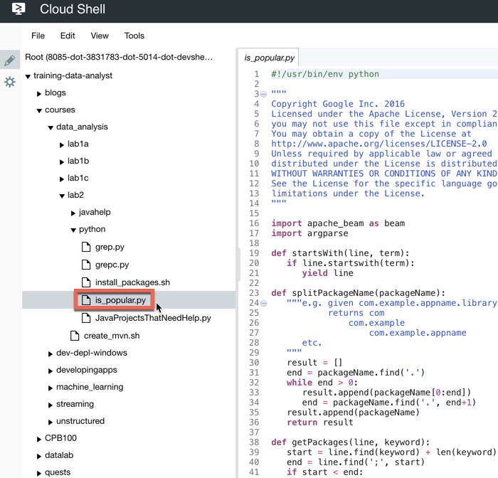

# MapReduce in Dataflow (Python)


## Overview

*Duration is 1 min*


In this lab, you learn how to use pipeline options and carry out Map and Reduce operations in Dataflow.

### __What you need__

You must have completed Lab 0 and have the following:

* Logged into GCP Console with your Qwiklabs generated account

### __What you learn__

In this lab, you learn how to:

* Use pipeline options in Dataflow
* Carry out mapping transformations
* Carry out reduce aggregations


## Introduction

*Duration is 1 min*


The goal of this lab is to learn how to write MapReduce operations using Dataflow.

## Setup


![[/fragments/start-qwiklab]]

![[/fragments/cloudshell]]

![[/fragments/opencloudshelleditor]]


## Identify Map and Reduce operations

*Duration is 5 min*


### __Step 1__

In CloudShell clone the source repo which has starter scripts for this lab:

```
git clone https://github.com/GoogleCloudPlatform/training-data-analyst
```

Then navigate to the code for this lab.

```
cd training-data-analyst/courses/data_analysis/lab2/python
```

### __Step 2__

Click __File__ > __Refresh__.

View the source code for __is\_popular.py__ for the pipeline using the Cloud Shell in-browser editor or with the command line using nano:



```
nano is_popular.py
```

### __Step 3__

What custom arguments are defined? \_\_\_\_\_\_\_\_\_\_\_\_\_\_\_\_\_\_\_\_

What is the default output prefix?  \_\_\_\_\_\_\_\_\_\_\_\_\_\_\_\_\_\_\_\_\_\_\_\_\_\_\_\_\_\_\_\_\_\_\_\_\_\_\_\_\_

How is the variable output\_prefix in main() set? \_\_\_\_\_\_\_\_\_\_\_\_\_\_\_\_\_\_\_\_\_\_\_\_\_\_\_\_\_

How are the pipeline arguments such as --runner set? \_\_\_\_\_\_\_\_\_\_\_\_\_\_\_\_\_\_\_\_\_\_

### __Step 4__

What are the key steps in the pipeline?     \_\_\_\_\_\_\_\_\_\_\_\_\_\_\_\_\_\_\_\_\_\_\_\_\_\_\_\_\_\_\_\_\_\_\_\_\_\_\_\_\_\_\_\_\_\_\_\_\_\_\_\_\_\_\_\_\_\_\_\_\_\_\_\_\_\_\_\_\_\_\_\_\_\_\_\_\_

Which of these steps happen in parallel? \_\_\_\_\_\_\_\_\_\_\_\_\_\_\_\_\_\_\_\_\_\_\_\_\_\_\_\_\_\_\_\_\_\_\_\_

Which of these steps are aggregations? \_\_\_\_\_\_\_\_\_\_\_\_\_\_\_\_\_\_\_\_\_\_\_\_\_\_\_\_\_\_\_\_\_\_\_\_\_


## Execute the pipeline

*Duration is 2 min*


### __Step 1__

Install the necessary dependencies for Python dataflow:

```
sudo ./install_packages.sh
```

Verify that you have the right version of pip (should be \> 8.0):

```
pip -V
```

If not, open a new CloudShell tab and it should pick up the updated pip.

### __Step 2__

Run the pipeline locally:

```
./is_popular.py
```

__Note:__ If you see an error that says "`No handlers could be found for logger "oauth2client.contrib.multistore_file",` you may ignore it. The error is simply saying that logging from the oauth2 library will go to stderr.

### __Step 3__

Examine the output file:

```
cat /tmp/output-*
```


## Use command line parameters

*Duration is 2 min*


### __Step 1__

Change the output prefix from the default value:

```
./is_popular.py --output_prefix=/tmp/myoutput
```

What will be the name of the new file that is written out?

### __Step 2__

Note that we now have a new file in the /tmp directory:

```
ls -lrt /tmp/myoutput*
```


## What you learned

*Duration is 1 min*


In this lab, you:

* Used pipeline options in Dataflow
* Identified Map and Reduce operations in the Dataflow pipeline

![[/fragments/endqwiklab]]

Last Tested Date: 12-07-2018

Last Updated Date: 12-07-2018

![[/fragments/copyright]]
