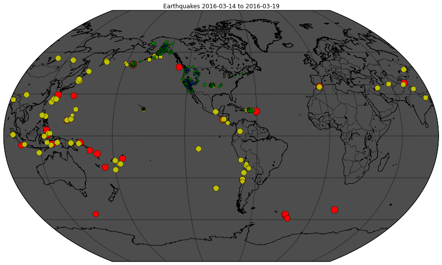
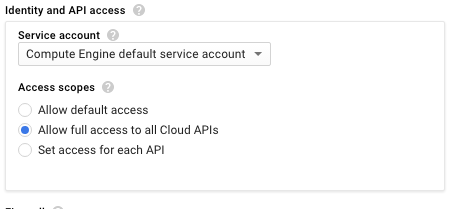
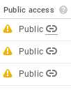

# Rent-a-VM to process earthquake data


## Overview

*Duration is 1 min*


In this lab, you spin up a virtual machine, configure its security, access it remotely, and then carry out the steps of an ingest-transform-and-publish data pipeline manually.

### __What you learn__

In this lab, you:

* Create a Compute Engine instance with the necessary Access and Security
* SSH into the instance
* Install the software package Git (for source code version control)
* Ingest data into a Compute Engine instance
* Transform data on the Compute Engine instance
* Store the transformed data on Cloud Storage
* Publish Cloud Storage data to the web


## Introduction

*Duration is 1 min*


In this lab, you spin up a virtual machine, install software on it, and use it to do scientific data processing.  We do not recommend that you work with Compute Engine instances at such a low-level, but you can!

In this lab, you will use Google Cloud Platform in a manner similar to the way you likely use clusters today. Spinning up a virtual machine and running your jobs on it is the closest you can get to working with the public cloud as simply rented infrastructure. It doesn't take advantage of the other benefits that Google Cloud Platform provides -- namely the ability to forget about infrastructure and work with your scientific computation problems simply as software that requires to be run.

You will ingest real-time earthquake data published by the United States Geological Survey (USGS) and create maps that look like this:



## Setup

![[/fragments/start-qwiklab]]

## Create Compute Engine instance with the necessary API access

*Duration is 4 min*


To create a Compute Engine instance:

### __Step 1__

Browse to  [https://cloud.google.com/](https://cloud.google.com/)

### __Step 2__

Click on __Go To Console__.

### __Step 3__

Click on the __Navigation menu__ (three horizontal lines):


### __Step 4__

Select __Compute Engine__.

### __Step 5__

Click __Create__ and wait for a form to load. You will need to change some options on the form that comes up.

### __Step 6__

For __Identity and API access__, in __Access scopes__, select __Allow full access to all Cloud APIs__:



### __Step 7__

Now, click __Create__


## SSH into the instance

*Duration is 2 min*


You can remotely access your Compute Engine instance using Secure Shell (SSH):

### Step 1

Click on __SSH__:


<aside class="special"><p><strong>Note</strong>:</p>
<p>SSH keys are automatically transferred, and that you can ssh directly from the browser, with no extra software needed. </p>
</aside>

### __Step 2__

To find some information about the Compute Engine instance, type the following into the command-line:

```bash
cat /proc/cpuinfo
```


## Install software

*Duration is 2 min*


### __Step 1__

Type the following into command-line:

```bash
sudo apt-get update
sudo apt-get -y -qq install git
```

### __Step 2__

Verify that git is now installed

```bash
git --version
```


## Ingest USGS data

*Duration is 3 min*


### __Step 1__

On the command-line, type:

```bash
git clone https://github.com/GoogleCloudPlatform/training-data-analyst
```

This clones the code repo.

### __Step 2__

Navigate to the folder corresponding to this lab:

```bash
cd training-data-analyst/courses/machine_learning/deepdive/01_googleml/earthquakes
```

### __Step 3__

Examine the ingest code using `less`:

```bash
less ingest.sh
```

The `less` command allows you to view the file (Press the `spacebar` to scroll down; the letter `b` to back up a page; the letter `q` to quit).

The program `ingest.sh` downloads a dataset of earthquakes in the past 7 days from the US Geological Survey.  Where is this file downloaded? To disk or to Cloud Storage? \_\_\_\_\_\_\_\_\_\_\_\_\_\_\_\_\_\_\_\_\_\_\_\_\_\_

### __Step 4__

Run the ingest code:

```bash
bash ingest.sh
```

### __Step 5__

Verify that some data has been downloaded:

```bash
head earthquakes.csv
```

The `head` command shows you the first few lines of the file.


## Transform the data

*Duration is 3 min*


You will use a Python program to transform the raw data into a map of earthquake activity:

### Step 1

The transformation code is explained in detail in this notebook:

[https://github.com/GoogleCloudPlatform/datalab-samples/blob/master/basemap/earthquakes.ipynb](https://github.com/GoogleCloudPlatform/datalab-samples/blob/master/basemap/earthquakes.ipynb)

Feel free to read the narrative to understand what the transformation code does.  The notebook itself was written in Datalab, a GCP product that you will use later in this set of labs.

### __Step 2__

First, install the necessary Python packages on the Compute Engine instance:

```bash
bash install_missing.sh
```

### __Step 3__

Then, run the transformation code:

```bash
./transform.py
```

### __Step 4__

You will notice a new image file if you list the contents of the directory:

```bash
ls -l
```


## Create bucket

*Duration is 2 min*


Create a bucket using the GCP console:

### __Step 1__

Browse to the GCP Console by visiting  [http://cloud.google.com](http://cloud.google.com) and clicking on __Go To Console__

### __Step 2__

Click on the __Navigation menu__ (3 bars) at the top-left and select __Storage__

### __Step 3__

Click on __Create bucket__.

### __Step 4__

Choose a globally unique bucket name (your project name is unique, so you could use that).  You can leave it as __Multi-Regional__, or improve speed and reduce costs by making it __Regional__. Then, click __Create__.

<aside class="warning"><p><strong>Note</strong>: Please pick a region from the following: <strong>us-east1, us-central1, asia-east1, europe-west1</strong>. These are the regions that currently support Cloud ML Engine jobs. Please verify <a href="https://cloud.google.com/ml-engine/docs/environment-overview#cloud_compute_regions" target="_blank">here</a> since this list may have changed after this lab was last updated. For example, if you are in the US, you may choose <strong>us-east1 </strong>as your region.</p>
</aside>

### __Step 5__

Note down the name of your bucket: \_\_\_\_\_\_\_\_\_\_\_\_\_\_\_\_\_\_\_\_\_\_\_\_\_\_\_\_\_\_\_

In this and future labs, you will insert this whenever the directions ask for `<YOUR-BUCKET>.`


## Store data

*Duration is 1 min*


To store the original and transformed data in Cloud Storage

### __Step 1__

In the SSH window of the Compute Engine instance, type:

```bash
gsutil cp earthquakes.* gs://<YOUR-BUCKET>/earthquakes/
```

to copy the files to Cloud Storage

### __Step 2__

On the GCP console, click on your bucket name, and notice there are three new files present in the earthquakes folder.


## Publish Cloud Storage files to web

*Duration is 2 min*


To publish Cloud Storage files to the web:

### __Step 1__

In the SSH window of the Compute Engine instance, type:

```bash
gsutil acl ch -u AllUsers:R gs://<YOUR-BUCKET>/earthquakes/*
```

### __Step 2__

Click on the __Public link__ corresponding to __earthquakes.htm__



### __Step 3__

What is the URL of the published Cloud Storage file? How does it relate to your bucket name and content?

\_\_\_\_\_\_\_\_\_\_\_\_\_\_\_\_\_\_\_\_\_\_\_\_\_\_\_\_\_\_\_\_\_\_\_\_\_\_\_\_\_\_\_\_\_\_\_\_\_\_\_\_\_\_

### __Step 4__

What are some advantages of publishing to Cloud Storage? \_\_\_\_\_\_\_\_\_\_\_\_\_\_\_\_\_\_\_\_\_\_\_\_\_\_\_\_\_\_\_\_\_\_\_\_\_\_\_\_\_\_\_\_\_


## Clean up

*Duration is 2 min*


To delete the Compute Engine instance (since we won't need it any more):

### __Step 1__

On the GCP console, click the __Navigation Menu__ (three horizontal bars) and select __Compute Engine__

### __Step 2__

Click on the checkbox corresponding to the instance that you created (the default name was instance-1)

### __Step 3__

Click on the __Delete__ button in the top-right corner

### __Step 4__

Does deleting the instance have any impact on the files that you stored on Cloud Storage? \_\_\_\_\_\_\_\_\_\_\_\_\_\_\_\_\_\_\_


## Summary

*Duration is 1 min*


In this lab, you used Google Cloud Platform (GCP) as rented infrastructure. You can spin up a Compute Engine VM, install custom software on it, and run your processing jobs. However, using GCP in this way doesn't take advantage of the other benefits that Google Cloud Platform provides -- namely the ability to forget about infrastructure and work with your scientific computation problems simply as software that requires to be run.

![[/fragments/endqwiklab]]

Last Tested Date: 03-08-2019

Last Updated Date: 03-11-2019

![[/fragments/copyright]]
