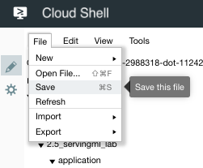

# Serving on Cloud MLE


## Overview

*Duration is 1 min*


In this lab, you build an AppEngine app to serve your ML predictions.  You get to modify the user-facing form and the python script and deploy them as an AppEngine app that makes requests to your deployed ML model.

### __What you learn__

In this lab, you:

* modify a simple UI form to get user input when making calls to your model
* build the http request to be made to your deployed ML model on Cloud MLE


## Setup


![[/fragments/start-qwiklab]]


## Start Cloud Shell


![[/fragments/cloudshell]]


## Copy trained model


### __Step 1__

Set necessary variables and create a bucket:

```bash
REGION=us-central1
BUCKET=$(gcloud config get-value project)
TFVERSION=1.7
gsutil mb -l ${REGION} gs://${BUCKET}
```

### __Step 2__

Copy trained model into your bucket:

```bash
gsutil -m cp -R gs://cloud-training-demos/babyweight/trained_model gs://${BUCKET}/babyweight
```


## Deploy trained model


### __Step 1__

Set necessary variables:

```bash
MODEL_NAME=babyweight
MODEL_VERSION=ml_on_gcp
MODEL_LOCATION=$(gsutil ls gs://${BUCKET}/babyweight/export/exporter/ | tail -1)
```

### __Step 2__

Deploy trained model:

```bash
gcloud ml-engine models create ${MODEL_NAME} --regions $REGION
gcloud ml-engine versions create ${MODEL_VERSION} --model ${MODEL_NAME} --origin ${MODEL_LOCATION} --runtime-version $TFVERSION
```


## Code for your frontend


### __Step 1__

Clone the course repository:

```bash
cd ~
git clone https://github.com/GoogleCloudPlatform/training-data-analyst
```

### __Step 2__

You can use the Cloud Shell code editor to view and edit the contents of these files.

Click on the () icon on the top right of your Cloud Shell window to launch Code Editor.

Once launched, navigate to the `~/training-data-analyst/courses/machine_learning/deepdive/06_structured/labs/serving` directory.

### __Step 3__

Open the <strong>`application/main.py`</strong>and <strong>`application/templates/form.html`</strong> files and notice the *\#TODO*s within the code. These need to be replaced with code. The next section tells you how.


## Modify main.py


### __Step 1__

Open the `main.py` file by clicking on it. Notice the lines with *\# TODO* for setting credentials and the api to use.

Set the credentials to use Google Application Default Credentials (recommended way to authorize calls to our APIs when building apps deployed on AppEngine):

```bash
credentials = GoogleCredentials.get_application_default()
```

Specify the api name (ML Engine API)  and version to use:

```bash
api = discovery.build('ml', 'v1', credentials=credentials)
```

### __Step 2__

Scroll further down in `main.py` and look for the next *\#TODO* in the method `get_prediction()`. In there, specify, using the __parent__ variable, the name of your trained model deployed on Cloud MLE:

```bash
parent = 'projects/%s/models/%s' % (project, model_name)
```

### __Step 3__

Now that you have all the pieces for making the call to your model, build the call request by specifying it in the __prediction__ variable:

```bash
prediction = api.projects().predict(body=input_data, name=parent).execute()
```

### __Step 4__

The final *\#TODO* (scroll towards bottom) is to get gestation\_weeks from the form data and cast into a float within the __features__ array:

```bash
features['gestation_weeks'] = float(data['gestation_weeks'])
```

### __Step 5__

Save the changes you made using the __File__ \> __Save__ button on the top left of your code editor window.




## Modify form.html


`form.html` is the front-end of your app.  The user fills in data (features) about the mother based on which we will make the predictions using our trained model.

### __Step 1__

In code editor, navigate to the `application/templates` directory and click to open the `form.html` file.

### __Step 2__

There is one *\#TODO* item here. Look for the div segment for __Plurality__ and add options for other plurality values (2, 3, etc).

```bash
<md-option value="2">Twins</md-option>
<md-option value="3">Triplets</md-option>
```

### __Step 3__

Save the changes you made using the __File__ \> __Save__ button on the top left of your code editor window.


## Deploy and test your app


### __Step 1__

In Cloud Shell, run the `deploy.sh` script to install required dependencies and deploy your app engine app to the cloud.

```bash
cd training-data-analyst/courses/machine_learning/deepdive/06_structured/labs/serving
./deploy.sh
```

<aside class="warning"><p>Note: Choose a region for App Engine when prompted and follow the prompts during this process</p>
</aside>

### __Step 2__

Go to the url `https://<PROJECT-ID>.appspot.com`  and start making predictions.

*Note: Replace \<PROJECT-ID\> with your Project ID.*

![[/fragments/endqwiklab]]

Last Tested Date: 12-11-2018

Last Updated Date: 12-11-2018

![[/fragments/copyright]]
