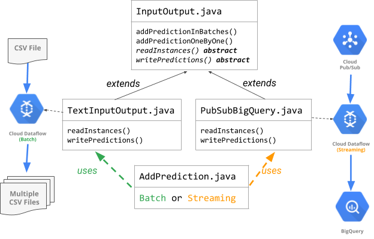
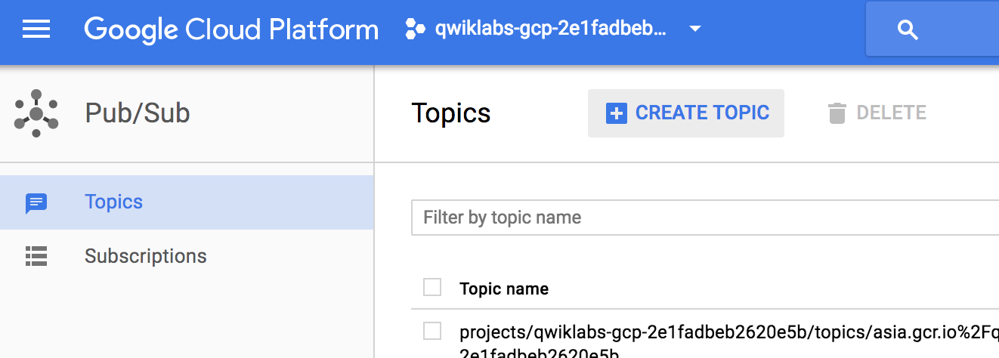
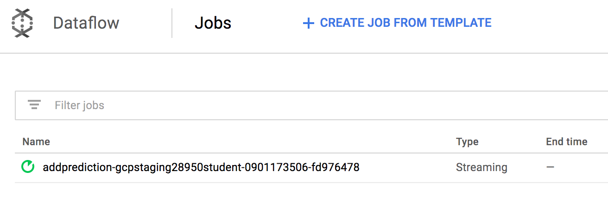
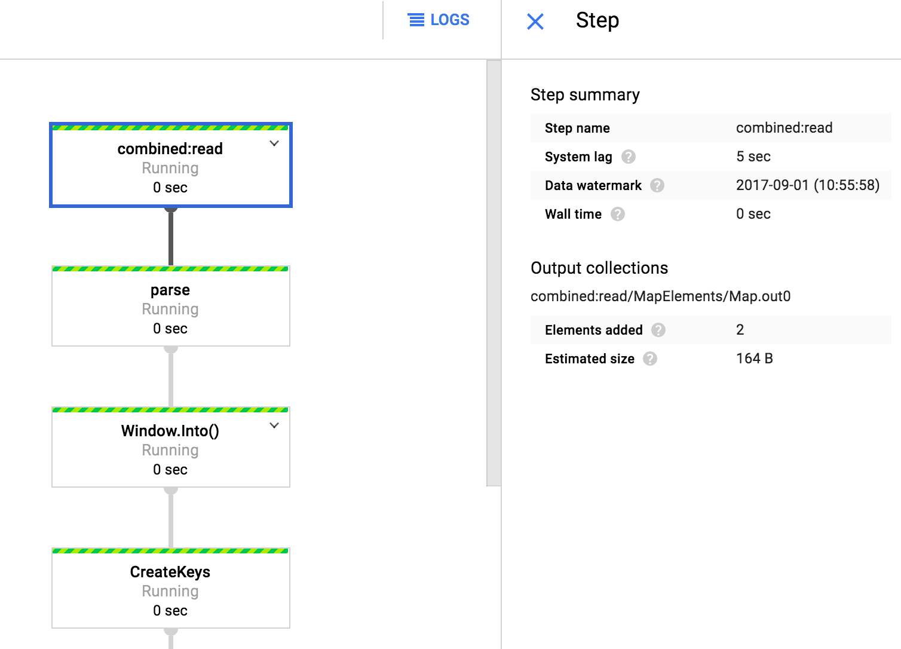
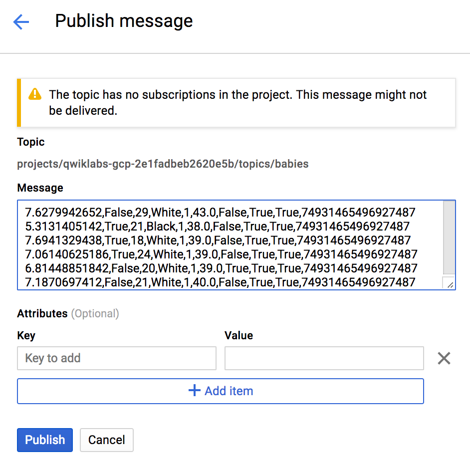
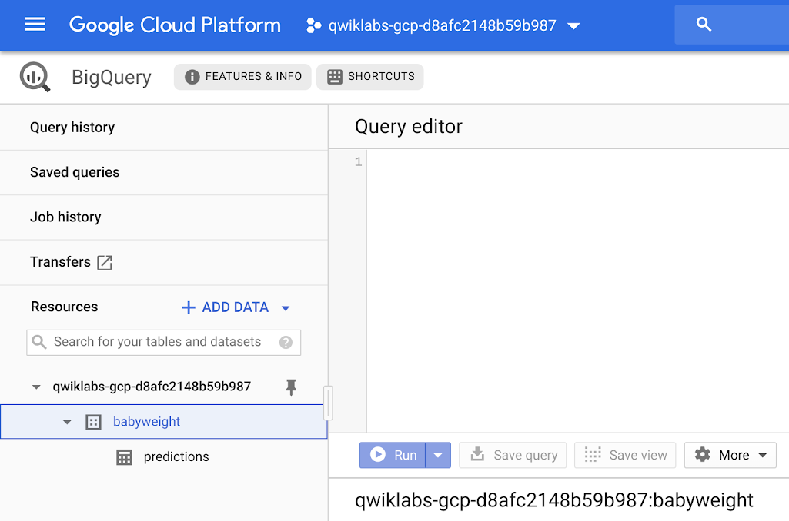
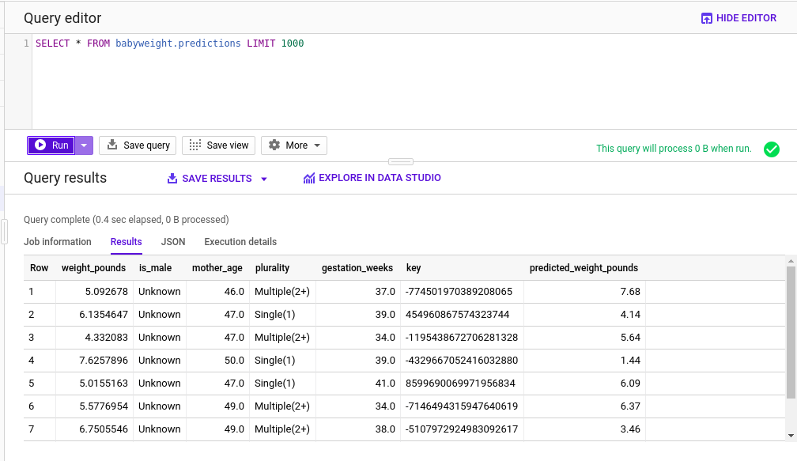
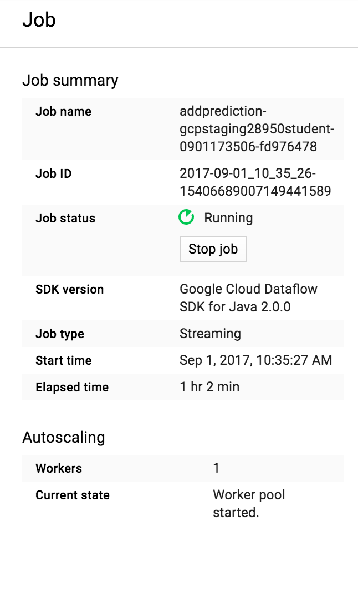

# Serving ML Predictions in batch and real-time


## Overview

*Duration is 1 min*


In this lab, you run Dataflow pipelines to serve predictions for batch requests as well as streaming in real-time.

### __What you learn__

In this lab, you write code to:

* Create a prediction service that calls your trained model deployed in Cloud to serve predictions
* Run a Dataflow job to have the prediction service read in batches from a CSV file and serve predictions
* Run a streaming Dataflow pipeline to read requests real-time from Cloud Pub/Sub and write predictions into a BigQuery table


## Setup


![[/fragments/start-qwiklab]]


## Start Cloud Shell


![[/fragments/cloudshell]]


## Copy trained model


### __Step 1__

Set necessary variables and create a bucket:

```bash
REGION=us-central1
BUCKET=$(gcloud config get-value project)
TFVERSION=1.7
gsutil mb -l ${REGION} gs://${BUCKET}
```

### __Step 2__

Copy trained model into your bucket:

```bash
gsutil -m cp -R gs://cloud-training-demos/babyweight/trained_model gs://${BUCKET}/babyweight
```

## Deploy trained model


### __Step 1__

Set necessary variables:

```bash
MODEL_NAME=babyweight
MODEL_VERSION=ml_on_gcp
MODEL_LOCATION=$(gsutil ls gs://${BUCKET}/babyweight/export/exporter/ | tail -1)
```

### __Step 2__

Deploy trained model:

```bash
gcloud ml-engine models create ${MODEL_NAME} --regions $REGION
gcloud ml-engine versions create ${MODEL_VERSION} --model ${MODEL_NAME} --origin ${MODEL_LOCATION} --runtime-version $TFVERSION
```

## Browse lab files

*Duration is 5 min*


### __Step 1__

Clone the course repository:

```bash
cd ~
git clone https://github.com/GoogleCloudPlatform/training-data-analyst
```

### __Step 2__

In Cloud Shell, navigate to the folder containing the code for this lab:

```bash
cd ~/training-data-analyst/courses/machine_learning/deepdive/06_structured/labs/serving
```

### __Step 3__

Run the `what_to_fix.sh` script to see a list of items you need to add/modify to existing code to run your app:

```bash
./what_to_fix.sh
```

As a result of this, you will see a list of filenames and lines within those files marked with __TODO__. These are the lines where you have to add/modify code. For this lab, you will focus on \#TODO items for __.java files only__, namely `BabyweightMLService.java` : which is your prediction service.

## How the code is organized




## Prediction service


In this section, you fix the code in __BabyweightMLService.java__ and test it with the __run\_once.sh__ script that is provided.  If you need help with the code, look at the next section that provides hints on how to fix code in BabyweightMLService.java.

### __Step 1__

You may use the Cloud Shell code editor to view and edit the contents of these files.

Click on the  () icon on the top right of your Cloud Shell window to launch Code Editor.

### __Step 2__

After it is launched, navigate to the following directory:

```bash
training-data-analyst/courses/machine_learning/deepdive/06_structured/labs/serving/pipeline/src/main/java/com/google/cloud/training/mlongcp
```

### __Step 3__

Open the `BabyweightMLService.java` files and replace *#TODOs* in the code.

### __Step 4__

Once completed, go into your Cloud Shell and run the `run_once.sh` script to test your ML service.

```bash
cd ~/training-data-analyst/courses/machine_learning/deepdive/06_structured/labs/serving
./run_once.sh
```

## Serve predictions for batch requests


This section of the lab calls AddPrediction.java that takes a batch input (one big CSV), calls the prediction service to generate baby weight predictions and writes them into local files (multiple CSVs).

### __Step 1__

In your Cloud Shell code editor, open the `AddPrediction.java` file available in the following directory:

```bash
training-data-analyst/courses/machine_learning/deepdive/06_structured/labs/serving/pipeline/src/main/java/com/google/cloud/training/mlongcp
```

### __Step 2__

Look through the code and notice how, based on input argument, it decides to set up a batch or streaming pipeline, and creates the appropriate TextInputOutput or PubSubBigQuery io object respectively to handle the reading and writing.

<aside class="special"><p><strong>Note: </strong>Look back at the diagram in  &#34;how code is organized&#34; section to make sense of it all.</p>
</aside>

### __Step 3__

Test batch mode by running the `run_ontext.sh` script provided in the lab directory:

```bash
cd ~/training-data-analyst/courses/machine_learning/deepdive/06_structured/labs/serving
./run_ontext.sh
```


## Serve predictions real-time with a streaming pipeline


In this section of the lab, you will launch a streaming pipeline with Dataflow, which will accept incoming information from Cloud Pub/Sub, use the info to call the prediction service to get baby weight predictions, and finally write that info into a BigQuery table.

### __Step 1__

On your GCP Console's left-side menu, go into __Pub/Sub__ and click the __CREATE TOPIC__ button on top. Create a topic called __babies__.



### __Step 2__

Back in your Cloud Shell, modify the script __`run_dataflow.sh`__ to get Project ID (using *--project*) from command line arguments, and then run as follows:

```bash
cd ~/training-data-analyst/courses/machine_learning/deepdive/06_structured/labs/serving
./run_dataflow.sh
```

This will create a streaming Dataflow pipeline.

### __Step 3__

Back in your GCP Console, use the left-side menu to go into __Dataflow__ and verify that the streaming job is created.



### __Step 4__

Next, click on the job name to view the pipeline graph. Click on the pipeline steps (boxes) and look at the run details (like system lag, elements added, etc.) of that step on the right side.



This means that your pipeline is running and waiting for input. Let's provide input through the Pub/Sub topic.

### __Step 5__

Copy some lines from your example.csv.gz:

```bash
cd ~/training-data-analyst/courses/machine_learning/deepdive/06_structured/labs/serving
zcat exampledata.csv.gz
```

### __Step 6__

On your  GCP Console, go back into __Pub/Sub__, click on the __babies__ topic, and then click on __Publish message__ button on top. In the message box, paste the lines you just copied from exampledata.csv.gz and click on __Publish__ button.



### __Step 7__

You may go back into Dataflow jobs on your GCP Console, click on your job and see how the run details have changed for the steps, for example click on write\_toBQ and look at Elements added.

### __Step 8__

Lets verify that the predicted weights have been recorded into the BigQuery table.

![[/fragments/bigquery-new-ui]]

Look at the left-side menu and you should see the __babyweight__ dataset. Click on the blue down arrow to its left, and you should see your __predictions__ table.

<aside class="special"><p><strong>Note: </strong>If you do not see the prediction table, give it a few minutes as the pipeline has allowed-latency and that can add some delay.</p>
</aside>




### __Step 9__

Type the query below in the __Query editor__ to retrieve rows from your predictions table..

```sql
SELECT * FROM babyweight.predictions LIMIT 1000
```


### __Step 10__

Click the __Run__ button. Notice the __predicted\_weights\_pounds__ column in the result.



### __Step 11__

Remember that your pipeline is still running. You can publish additional messages from your example.csv.gz and verify new rows added to your predictions table. Once you are satisfied, you may stop the Dataflow pipeline by going into your Dataflow Jobs page, and click the __Stop job__ button on the right side Job summary window. Select __Drain__ and click __Stop Job__.




![[/fragments/endqwiklab]]

##### Manual Last Updated: March 22, 2019

##### Lab Last Tested: March 22, 2019

![[/fragments/copyright]]
