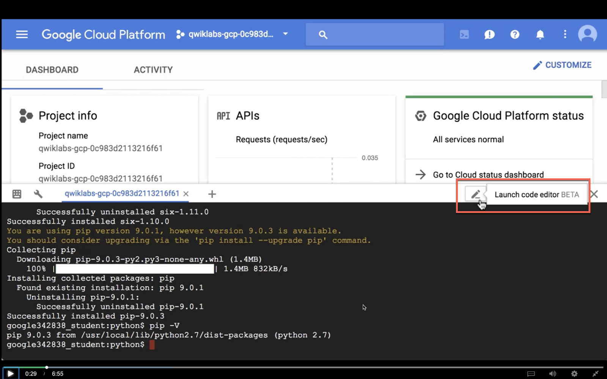
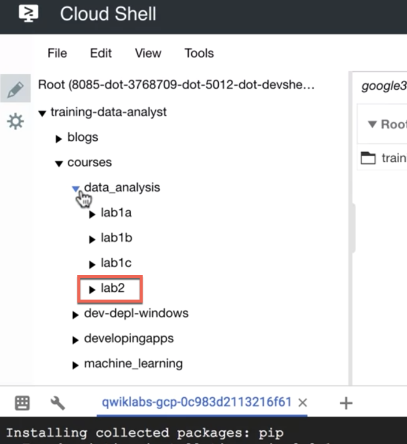
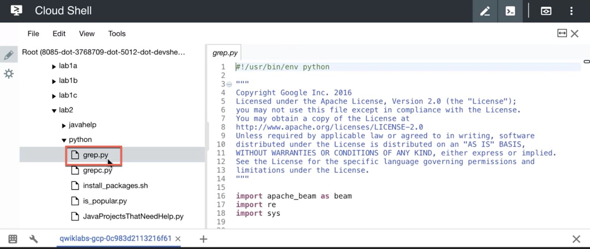
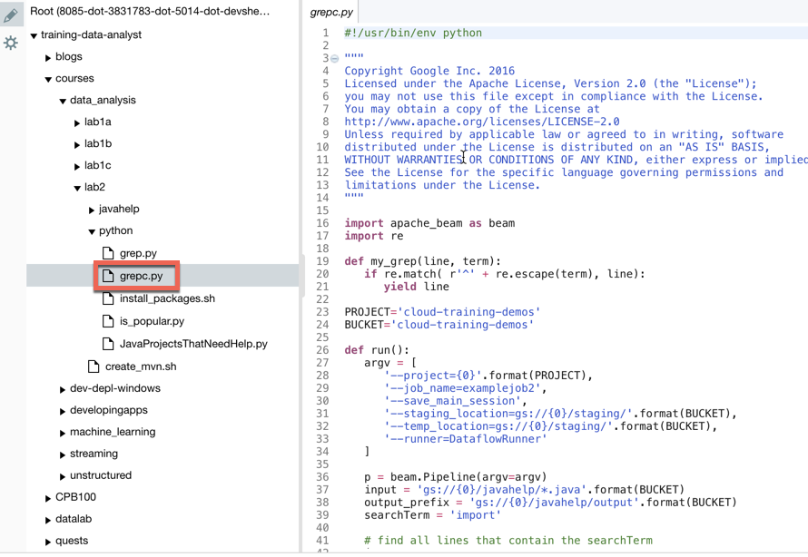
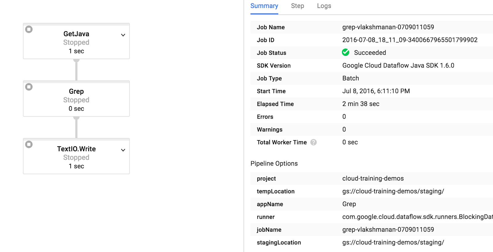

# A simple Dataflow pipeline (Python)


## Overview

*Duration is 1 min*


In this lab, you learn how to write a simple Dataflow pipeline and run it both locally and on the cloud.


### __What you learn__

In this lab, you learn how to:

* Write a simple pipeline in Python
* Execute the query on the local machine
* Execute the query on the cloud


## Introduction

*Duration is 1 min*


The goal of this lab is to become familiar with the structure of a Dataflow project and learn how to execute a Dataflow pipeline.


## Setup


![[/fragments/start-qwiklab]]


## Open Dataflow project

*Duration is 3 min*


### __Step 1__

Start CloudShell and clone the source repo which has starter scripts for this lab:

```bash
git clone https://github.com/GoogleCloudPlatform/training-data-analyst
```

Then navigate to the code for this lab:

```bash
cd training-data-analyst/courses/data_analysis/lab2/python
```

### __Step 2__

Install the necessary dependencies for Python dataflow:

```bash
sudo ./install_packages.sh
```

Verify that you have the right version of pip (should be \> 8.0):

```bash
pip -V
```

If not, open a new CloudShell tab and it should pick up the updated pip.


## Pipeline filtering

*Duration is 5 min*


### __Step 1__

View the source code for the pipeline using the Cloud Shell file browser:



In the file directory, navigate to __/training-data-analyst/courses/data\_analysis/lab2/python__.



Find __grep.py__.



Or you can navigate to the directly and view the file using __nano__ if you prefer:

```bash
nano grep.py
```

### __Step 2__

What files are being read? \_\_\_\_\_\_\_\_\_\_\_\_\_\_\_\_\_\_\_\_\_\_\_\_\_\_\_\_\_\_\_\_\_\_\_\_\_\_\_\_\_\_\_\_\_\_\_\_\_\_\_\_\_

What is the search term? \_\_\_\_\_\_\_\_\_\_\_\_\_\_\_\_\_\_\_\_\_\_\_\_\_\_\_\_\_\_\_\_\_\_\_\_\_\_\_\_\_\_\_\_\_\_\_\_\_\_\_\_\_\_

Where does the output go? \_\_\_\_\_\_\_\_\_\_\_\_\_\_\_\_\_\_\_\_\_\_\_\_\_\_\_\_\_\_\_\_\_\_\_\_\_\_\_\_\_\_\_\_\_\_\_\_\_\_\_

There are three transforms in the pipeline:

1. What does the transform do? \_\_\_\_\_\_\_\_\_\_\_\_\_\_\_\_\_\_\_\_\_\_\_\_\_\_\_\_\_\_\_\_\_
2. What does the second transform do? \_\_\_\_\_\_\_\_\_\_\_\_\_\_\_\_\_\_\_\_\_\_\_\_\_\_\_\_\_\_

* Where does its input come from? \_\_\_\_\_\_\_\_\_\_\_\_\_\_\_\_\_\_\_\_\_\_\_\_
* What does it do with this input? \_\_\_\_\_\_\_\_\_\_\_\_\_\_\_\_\_\_\_\_\_\_\_\_\_\_
* What does it write to its output? \_\_\_\_\_\_\_\_\_\_\_\_\_\_\_\_\_\_\_\_\_\_\_\_\_\_
* Where does the output go to? \_\_\_\_\_\_\_\_\_\_\_\_\_\_\_\_\_\_\_\_\_\_\_\_\_\_\_\_

3. What does the third transform do? \_\_\_\_\_\_\_\_\_\_\_\_\_\_\_\_\_\_\_\_\_


## Execute the pipeline locally

*Duration is 2 min*


### __Step 1__

Execute locally:

```bash
python grep.py
```

Note: if you see an error that says "`No handlers could be found for logger "oauth2client.contrib.multistore_file",` you may ignore it. The error is simply saying that logging from the oauth2 library will go to stderr.

### __Step 2__

Examine the output file:

```bash
cat /tmp/output-*
```

Does the output seem logical?  \_\_\_\_\_\_\_\_\_\_\_\_\_\_\_\_\_\_\_\_\_\_


## Execute the pipeline on the cloud

*Duration is 10 min*


### __Step 1__

If you don't already have a bucket on Cloud Storage, create one from the  [Storage section of the GCP console](http://console.cloud.google.com/storage). Bucket names have to be globally unique.

### __Step 2__

Copy some Java files to the cloud (make sure to replace `<YOUR-BUCKET-NAME>` with the bucket name you created in the previous step):

```bash
gsutil cp ../javahelp/src/main/java/com/google/cloud/training/dataanalyst/javahelp/*.java gs://<YOUR-BUCKET-NAME>/javahelp
```

### __Step 3__

Edit the Dataflow pipeline in `grepc.py` by opening up in the Cloud Shell in-browser editor again or by using the command line with nano:



```bash
nano grepc.py
```

and changing the __PROJECT__ and __BUCKET__ variables appropriately.

### __Step 4__

Submit the Dataflow to the cloud:

```bash
python grepc.py
```

Because this is such a small job, running on the cloud will take significantly longer than running it locally (on the order of 2-3 minutes).

### __Step 5__

On your  [Cloud Console](https://console.cloud.google.com/), navigate to the __Dataflow__ section (from the 3 bars on the top-left menu), and look at the Jobs.  Select your job and monitor its progress. You will see something like this:



### __Step 6__

Wait for the job status to turn to __Succeeded__. At this point, your CloudShell will display a command-line prompt.  In CloudShell, examine the output:

```bash
gsutil cat gs://<YOUR-BUCKET-NAME>/javahelp/output-*
```


## What you learned

*Duration is 1 min*


In this lab, you:

* Executed a Dataflow pipeline locally
* Executed a Dataflow pipeline on the cloud.

![[/fragments/endqwiklab]]

Last Tested Date: 12-05-2018

Last Updated Date: 12-05-2018

![[/fragments/copyright]]
