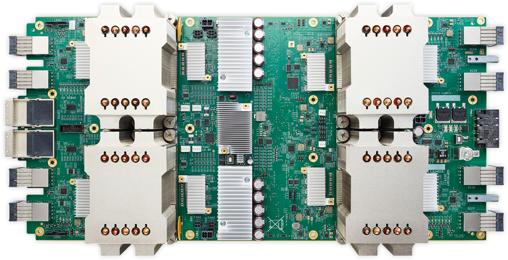

# Training a ResNet Image Classifier from Scratch with TPUs on Cloud Machine Learning Engine


## Overview:


In this lab you will train a state-of-the-art image classification model on your own data using Google's Cloud TPUs from CloudShell. 

### What you learn

In this lab, you learn how to:

* Convert JPEG files into TensorFlow records
* Train a ResNet image classifier
* Deploy the trained model as a web service
* Invoke the web service by sending it a JPEG image


## A brief primer on ResNet and TPUs


The more layers you have in a neural network, the more accurate it should be at image classification. However, deep neural networks are harder to train -- in practice, this difficulty overwhelms the optimization algorithm and so, as you increase the number of layers, the training error starts to increase. One way to address this optimization problem is to introduce a "shortcut" connection that does an identity mapping and ask the optimizer to focus on the residual (or difference):


*Image from:* [Deep Residual Learning for Image Recognition](https://arxiv.org/abs/1512.03385)

A neural network consisting of such blocks turns out to be easier to train even if it has just as many layers as a deep neural network without the shortcut connections. Such deep residual networks swept the field of image and object recognition competitions and are now considered state-of-the-art models for image analysis tasks.

Tensor Processing Units (TPUs) are application-specific integrated circuit (ASIC) hardware accelerators for machine learning. They were custom-designed by Google to carry out TensorFlow operations and can provide significant speedups in machine learning tasks that are compute-bound (rather than I/O bound). Training deep residual networks for image classification is one such task. In  [independent tests conducted by Stanford University](https://dawn.cs.stanford.edu/benchmark/), the ResNet-50 model trained on a TPU was the fastest to achieve a desired accuracy on a standard datasets[1]. If you use TPUs on serverless infrastructure as Cloud ML Engine, this also translates to lower cost, since you pay only for what you use and don't have to keep any machines up and running.



*TPUs can speed up training of state-of-the-art models.*

## Test your understanding

<ql-multiple-choice-probe stem="TPUs are custom designed to carry out what operations efficiently?"
                          optionTitles='[
                            "Stackdriver",
                            "Tensorflow",
                            "BigQuery",
                            "Cloud Function"
                          ]'
                          answerIndex="1"
                          shuffle>
</ql-multiple-choice-probe>

<ql-true-false-probe stem="It's a good idea to use TPUs on machine learning tasks that are I/O bound."
                     answer="false">
</ql-true-false-probe>

<ql-true-false-probe stem="TPUs provide the fastest, most cost-effective way to train state-of-the-art image models."
                     answer="true">
</ql-true-false-probe>


## Setup your environment


![[/fragments/startqwiklab]]


![[/fragments/cloudshell]]

## Using the Cloud Machine Learning Engine and Dataflow APIs

The Cloud Machine Learning Engine and Dataflow APIs have been enabled for you for this lab. To enable them in your own environmnet, follow these instructions.

Navigate to [https://console.cloud.google.com/apis/library](https://console.cloud.google.com/apis/library), search for __Cloud Machine Learning Engine__ and click on ENABLE button if it is not already enabled.

Navigate to  [https://console.cloud.google.com/apis/library](https://console.cloud.google.com/apis/library), search for __Dataflow API__ and click on ENABLE button if it is not already enabled.

## Clone repository

In CloudShell, run the following to clone the repository:

```
git clone https://github.com/GoogleCloudPlatform/training-data-analyst
```


## Explore data


*[Sunflowers](https://www.flickr.com/photos/calliope/1008566138/)* by Liz West is licensed under [CC BY 2.0](https://creativecommons.org/licenses/by/2.0/)

You have about 3,600 flower images in five categories. The images are randomly split into a training set with 90% data and an evaluation set with 10% data listed in CSV files:

* Training set:  [train_set.csv](https://storage.cloud.google.com/cloud-ml-data/img/flower_photos/train_set.csv)
* Evaluation set:  [eval_set.csv](https://storage.cloud.google.com/cloud-ml-data/img/flower_photos/eval_set.csv)

Explore the format and contents of the `train.csv` by running:

```
gsutil cat gs://cloud-ml-data/img/flower_photos/train_set.csv | head -5 > /tmp/input.csv
cat /tmp/input.csv
```

How would you find all the types of flowers in the training dataset? 

Answer: The first field is the GCS location of the image file, and the second field is the label. In this case, the label is the type of flower.


The set of all the labels is called the dictionary. Run the following to find them:

```
gsutil cat gs://cloud-ml-data/img/flower_photos/train_set.csv  | sed 's/,/ /g' | awk '{print $2}' | sort | uniq > /tmp/labels.txt
cat /tmp/labels.txt
```

What does label=3 correspond to? 

Answer: The label file is used to translate labels into internal ID numbers in the following processes such as daisy=0, dandelion=1, etc. (it is 0-based). So, label=3 would correspond to sunflowers. The code extracts the second field out of the CSV file and determines the unique list.


Because this Google Cloud Storage bucket is public, you can view the images using http. An GCS URI such as:

gs://cloud-ml-data/img/flower_photos/daisy/754296579_30a9ae018c_n.jpg

is published on http as:
[https://storage.cloud.google.com/cloud-ml-data/img/flower\_photos/daisy/754296579\_30a9ae018c\_n.jpg](https://storage.cloud.google.com/cloud-ml-data/img/flower\_photos/daisy/754296579\_30a9ae018c\_n.jpg)

Click on the above link to view the image. What type of flower is it? 

Answer: This is the first line of the train_set.csv, and the label states that it is a daisy. I hope that is correct!


## Convert JPEG images to TensorFlow records


We do not want our training to be limited by I/O speed, so let's convert the JPEG image data into TensorFlow records. These are an efficient format particularly suitable for batch reads by the machine learning framework.

The conversion will be carried in Cloud Dataflow, the serverless ETL service on Google Cloud Platform.

Get ResNet code by running:

```
cd ~/training-data-analyst/quests/tpu
bash ./copy_resnet_files.sh 1.9
```

__Note:__ The 1.9 refers to the version of TensorFlow.

Examine what has been copied over by running:

```
ls mymodel/trainer
```

Notice that ResNet model code has been copied over from  [https://github.com/tensorflow/tpu/tree/master/models/official/resnet](https://github.com/tensorflow/tpu/tree/master/models/official/resnet)

There are a number of other pre-built models for various other tasks in that repository.

Now create an output bucket to hold the TensorFlow records.

From the GCP navigation menu, go to __Storage__ > __Browser__ and create a new bucket. The bucket name has to be [universally unique](https://cloud.google.com/storage/docs/naming).

Set BUCKET and PROJECT environment variables:

```
export BUCKET=<BUCKET>
export PROJECT=$(gcloud config get-value project)
echo $BUCKET $PROJECT
```

Install the Apache Beam Python package:

```
sudo pip install 'apache-beam[gcp]'
```

Apache Beam is the open-source library for code that is executed by Cloud Dataflow.

Now run the conversion program:

```
export PYTHONPATH=${PYTHONPATH}:${PWD}/mymodel
gsutil -m rm -rf gs://${BUCKET}/tpu/resnet/data
python -m trainer.preprocess \
       --train_csv gs://cloud-ml-data/img/flower_photos/train_set.csv \
       --validation_csv gs://cloud-ml-data/img/flower_photos/eval_set.csv \
       --labels_file /tmp/labels.txt \
       --project_id $PROJECT \
       --output_dir gs://${BUCKET}/tpu/resnet/data
```

Wait for the Dataflow job to finish. Navigate to __Navigation menu__ > __Dataflow__ and look at the submitted jobs. Wait for the recently submitted job to finish. This will take 15-20 minutes.


## Train model


Verify that the TensorFlow records exist by running:

```
gsutil ls gs://${BUCKET}/tpu/resnet/data
```

You should see `train-*` and `validation-*` files. If no files are present, wait for the Dataflow job in the previous section to finish.

Enable the Cloud TPU account:

```
bash enable_tpu_mlengine.sh
```

Submit the training job:

```
TOPDIR=gs://${BUCKET}/tpu/resnet
REGION=us-central1
OUTDIR=${TOPDIR}/trained
JOBNAME=imgclass_$(date -u +%y%m%d_%H%M%S)
echo $OUTDIR $REGION $JOBNAME
gsutil -m rm -rf $OUTDIR  # Comment out this line to continue training from the last time
gcloud ml-engine jobs submit training $JOBNAME \
 --region=$REGION \
 --module-name=trainer.resnet_main \
 --package-path=$(pwd)/mymodel/trainer \
 --job-dir=$OUTDIR \
 --staging-bucket=gs://$BUCKET \
 --scale-tier=BASIC_TPU \
 --runtime-version=1.9 \
 -- \
 --data_dir=${TOPDIR}/data \
 --model_dir=${OUTDIR} \
 --resnet_depth=18 \
 --train_batch_size=128 --eval_batch_size=32 --skip_host_call=True \
 --steps_per_eval=250 --train_steps=1000 \
 --num_train_images=3300  --num_eval_images=370  --num_label_classes=5 \
 --export_dir=${OUTDIR}/export
```

Wait for the ML Engine job to finish.

Navigate to  [https://console.cloud.google.com/mlengine](https://console.cloud.google.com/mlengine) and look at the submitted jobs. Wait for the recently submitted job to finish. *This will take 15-20 minutes.*


## Examine training outputs


View training graph by running the following to launch TensorBoard:

```
tensorboard --logdir gs://${BUCKET}/tpu/resnet/trained --port=8080
```

Now you can open TensorBoard.

From the __Web Preview__ menu at the top of CloudShell, select __Preview on Port 8080__.


As your models get larger, and you export more checkpoints, you may need to wait 1-2 minutes for TensorBoard to load the data.

__View training graph__

Change to scalar graphs and view the loss and top_1_accuracy plots.

* Does the loss curve show that the train loss has plateaued?
* Does the evaluation loss indicate overfitting? 
* Is the top_1_accuracy sufficient?
* How would you use the answers to the above questions?

Answers:

If the loss curve has not plateaued, re-run the training job for more training steps. Make sure you are not deleting the output directory, so that the training commences from the previous point.


If the evaluation loss (blue curve) is much higher than the training loss (orange curve), especially if the evaluation loss starts to increase, stop training (do an early-stop), reduce the ResNet model depth, or increase the size of your datasets.

If the top_1_accuracy is insufficient, increase the size of your dataset.


## Deploy model


__View exported model__

In CloudShell, press __Ctrl__+__C__ if necessary to get back to the command prompt and run:

```
gsutil ls gs://${BUCKET}/tpu/resnet/trained/export/
```

Deploy trained model as a web service by running:

```
MODEL_NAME="flowers"
MODEL_VERSION=resnet
MODEL_LOCATION=$(gsutil ls gs://${BUCKET}/tpu/resnet/trained/export/ | tail -1)
echo "Deleting and deploying $MODEL_NAME $MODEL_VERSION from $MODEL_LOCATION ... this will take a few minutes"
gcloud ml-engine models create ${MODEL_NAME} --regions $REGION
gcloud ml-engine versions create ${MODEL_VERSION} --model ${MODEL_NAME} --origin ${MODEL_LOCATION} --runtime-version=1.9
```

*This will take 4-5 minutes.*


Invoke the model:

```
python invoke_model.py  --project=$PROJECT --jpeg=gs://cloud-ml-data/img/flower_photos/sunflowers/1022552002_2b93faf9e7_n.jpg
```

The first image will take about a minute as service loads. Subsequent calls will be faster. Try other images.

## Learn More / Next Steps
 

Please see  [this blog post](https://cloud.google.com/blog/big-data/2018/07/how-to-train-a-resnet-image-classifier-from-scratch-on-tpus-on-cloud-ml-engine) for more details about ResNet image classifier.


## Clean up


When you take a lab, all of your resources will be deleted for you when you're finished. But in the real world, you need to do it yourself to avoid incurring charges.

![[/fragments/endqwiklab]]

Manual Last Updated: March 15, 2019

Lab Last Tested: January 9, 2019

![[/fragments/copyright]]
